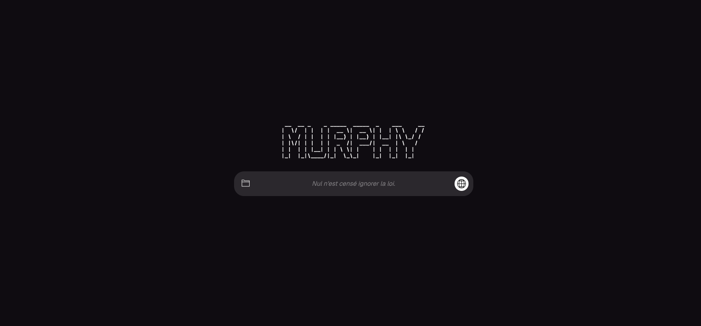
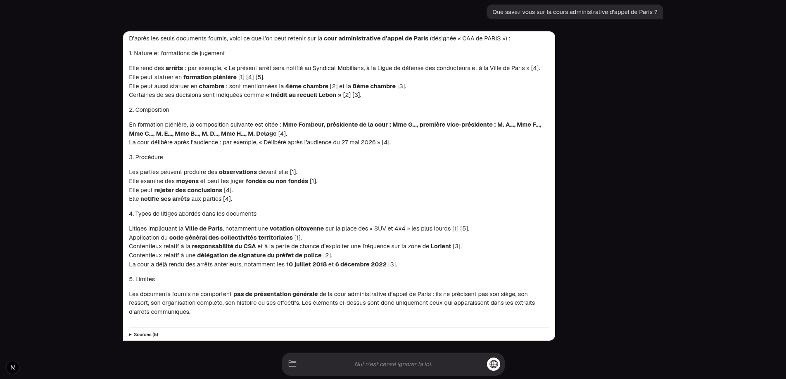
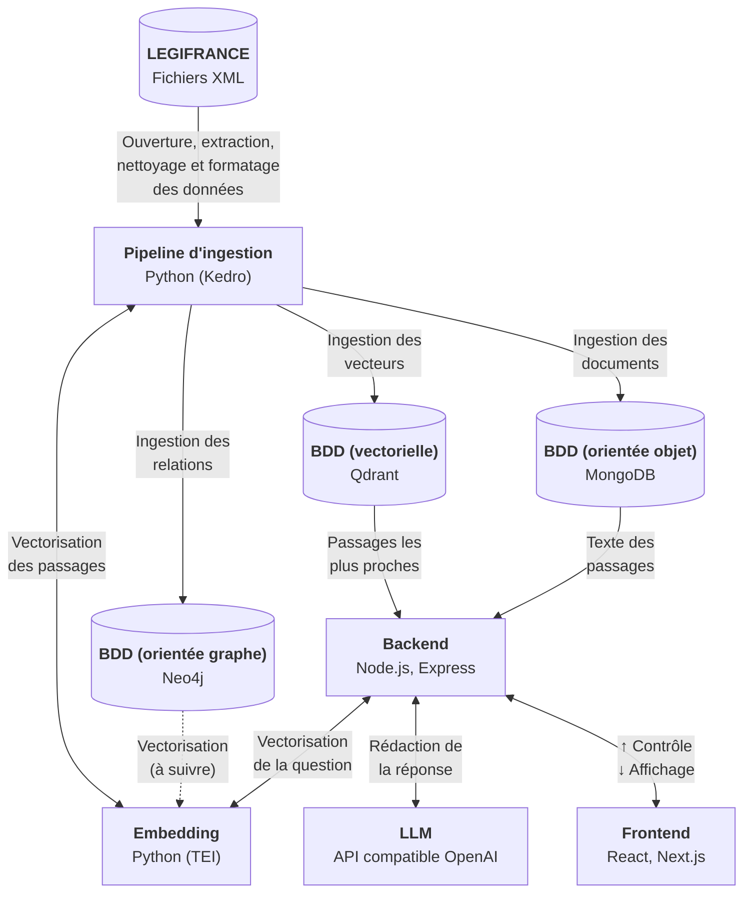
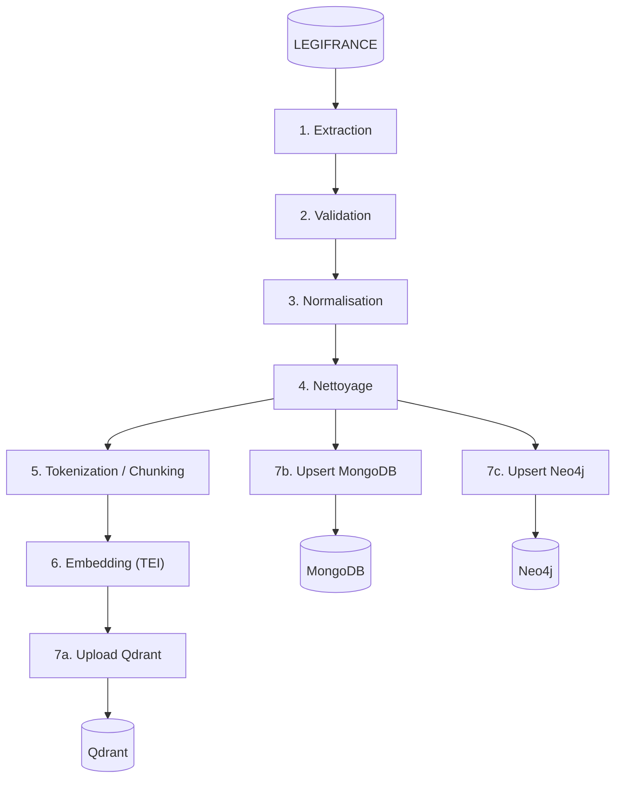

<p align="center">
  
</p>

Retrouver la décision ou l'article de loi qui répond à une question suppose, sur
Légifrance, de connaître déjà les bons mots-clés. Murphy prend la question en langage
naturel, retrouve les passages pertinents dans les codes, les lois et la jurisprudence
publiés par la DILA, et rédige une réponse qui cite ses sources.

<p align="center">
  
</p>

<p align="center">
  
</p>

## Architecture

### Vue d'ensemble



<p align="center"><i>Figure 1 - Le trajet des données</i></p>

L'ingestion découpe les documents en passages, les vectorise et les écrit dans les
bases. Le backend peut ensuite les lire. Les deux ne partagent aucun code, seulement les
bases de données. Neo4j garde le graphe des relations entre documents (citations, textes et leurs articles), que le backend exploitera dans une version future.

### Pipeline d'ingestion



<p align="center"><i>Figure 2 - Les étapes d'un run d'ingestion</i></p>

La documentation technique est dans [docs/technical/](docs/technical/ARCHITECTURE.md),
les décisions d'architecture dans [docs/pilotage/ADR/](docs/pilotage/ADR/INDEX.md).

## Stack technique

| Partie | Technologies |
|---|---|
| Frontend | Next.js 16, React 19, Tailwind CSS 4, AI SDK |
| Backend | Node.js 22, Express, TypeScript, WebSocket (`ws`), Pino |
| Contrat partagé | zod, paquet npm interne `@murphy/contract` |
| Ingestion | Python 3.13, Kedro, Pydantic, uv |
| Données | MongoDB 8, Qdrant 1.16, Neo4j 2025 |
| Embeddings | Text Embeddings Inference (Hugging Face), `all-mpnet-base-v2` |
| Outillage | Docker Compose, GitHub Actions, ESLint, Vitest, Jest, Ruff, mypy, pytest |

## Lancer le projet

### Prérequis

- Docker et Docker Compose
- un GPU NVIDIA et le NVIDIA Container Toolkit, pour le service d'embedding
- Node.js et uv
- Une clé d'API pour un LLM exposant une API compatible OpenAI

### 1. Installer et configurer

```bash
npm install                  
cp .env.example .env.dev
```

Dans `.env.dev`, renseigner au minimum `LLM_API_ENDPOINT`, `LLM_API_KEY`, `LLM_MODEL`,
et `XML_SOURCE_PATH`, le chemin **absolu** du corpus.

### 2. Télécharger le corpus

Les archives XML sont sur <https://echanges.dila.gouv.fr/OPENDATA/>, un dossier par
base. Extraire chaque archive de stock dans un sous-répertoire de `XML_SOURCE_PATH`
portant le nom de la base :

```
$XML_SOURCE_PATH/
├── LEGI/
├── CASS/
├── INCA/
├── CAPP/
├── JADE/
└── CONSTIT/
```

### 3. Démarrer les services

```bash
npm run up
```


### 4. Ingérer le corpus

```bash
cd data
kedro run                          # toutes les six bases
kedro run --params source=legi     # une seule base
```

### 5. Ouvrir l'application

Le frontend est sur <http://localhost:3000>, l'API sur <http://localhost:5000/api/v1>. </br>
`npm run status` liste l'état des conteneurs. </br> `npm run down` arrête la stack.

## Licence

Code : tous droits réservés. </br> Les données juridiques proviennent de la DILA et sont sous Licence Ouverte 2.0.
