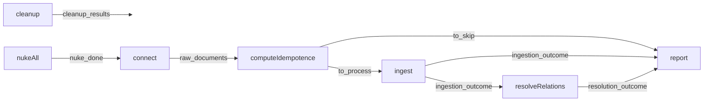

# Architecture — pipeline d'ingestion

## Ce que c'est

Un pipeline **Kedro** qui ingère les corpus XML de la DILA (LEGIFRANCE et les cinq bases de
jurisprudence) et peuple les trois bases que le backend de serving lit : MongoDB (contenu),
Qdrant (vecteurs), Neo4j (graphe). Il tourne **hors-ligne et hors-bande** : il n'est pas dans
la stack Docker de serving, et le backend ne l'appelle jamais — les deux ne partagent que
les bases.

## Les deux couches du dépôt

```
data/
├── conf/base/            # workflow/ingestion/evaluation (partition ADR-026), catalog.yml (objets runtime)
├── src/data/             # le SHELL Kedro : délègue tout à ragcore
│   ├── pipeline_registry.py   →  ragcore.orchestration.kedro.pipeline_registry
│   └── settings.py            →  enregistre ragcore…hooks.TelemetryHooks + structlog
└── src/ragcore/          # le CŒUR : toute la logique vit ici
    ├── core/             # domaine pur : modèles, ports, services — ne connaît AUCUNE base
    ├── application/      # cas d'usage : runner, saga, résolution de relations
    ├── adapters/         # implémentations : Mongo, Neo4j, Qdrant, embedders, télémétrie, MLflow
    ├── sources/          # connecteurs + tables de rôles par source, mécanique générique
    └── orchestration/    # le pont Kedro : hooks, DAG, nœuds, workload
```

`ragcore` est **vendoré dans ce dépôt** (`src/ragcore/`) — ce n'est plus un paquet externe.
Architecture hexagonale stricte : `core/` déclare des **ports** (interfaces), `adapters/`
les implémente, et `orchestration/kedro/` n'est qu'un shell — un CLI ou un test peut
lancer le même pipeline sans Kedro ni YAML.

## Le DAG

Un seul pipeline, enregistré sous `__default__` et `ingestion` (un alias, pas deux
pipelines). L'ordre est exprimé par les **dépendances de données**, jamais par un
`join()` impératif :



Deux arêtes portent tout le sens :

- **`nuke_done` → `connect`** : on ne lit pas la source pendant qu'on efface les stores.
- **`ingestion_outcome` → `resolveRelations`** : LA barrière phase 1 / phase 2. Une arête
  Neo4j a besoin que ses deux nœuds existent ; tant que la phase 1 n'a pas fini pour
  *tous* les documents, Kedro ne lance pas la phase 2. La barrière est structurelle.

Les objets runtime (connecteur, parser, dépôts, runner, télémétrie…) ne sont pas des
paramètres : ce sont des `MemoryDataset` que `TelemetryHooks.before_pipeline_run`
construit et pose au catalogue (`catalog.yml`, tout en `copy_mode: assign`). Le DAG les
**nomme**, le hook les **fournit**.

Déroulé détaillé nœud par nœud : [reference/pipeline.md](reference/pipeline.md).

## Les deux phases

- **Phase 1 — documents** (`ingest`) : un pool de 4 workers, dispatch par clé document
  (hash blake2b de l'identifiant). Chaque worker a sa boucle asyncio, ses clients Mongo /
  Neo4j / Qdrant, sa télémétrie et son agrégat local : rien de mutable n'est partagé, donc
  aucun verrou. Le travail d'un document (le *workload*) : extraction des
  relations/citations → chunking → embedding → saga d'écriture (Mongo → Qdrant → nœud
  Neo4j) → manifest.
- **Phase 2 — relations** (`resolveRelations`) : après la barrière, un service unique
  écrit les arêtes en batch, met en attente celles dont la cible n'est pas dans le corpus
  (`meta_pending_relations`) et **promeut** les pendantes de runs passés dont la cible
  vient d'arriver.

## Les principes qui structurent tout le reste

1. **Fail-fast, jamais de dégradation silencieuse.** Un `parameters.yml` illisible arrête
   le run ; un `.env.dev` absent lève ; une source inconnue échoue au démarrage en nommant
   les valides ; le modèle servi par TEI est vérifié (`GET /info`) avant la moindre écriture.

2. **« Rien en silence ».** Tout ce qui est vu est compté : documents écartés, invalidés,
   échoués, compensations, écritures d'audit perdues, vocabulaire inconnu. Le statut d'un
   run (`ok`/`degraded`/`failed`) se **dérive des compteurs** — l'équation de complétude
   `vus == ingérés + exclus + échoués` — jamais de l'absence d'exception.
   Voir [reference/telemetrie.md](reference/telemetrie.md).

3. **La collection Qdrant est dérivée, pas configurée.** Son nom est le hash blake2b de la
   `WorkflowConfig` (normalisation + chunking + embedding — ce qui décide des vecteurs, et
   rien d'autre). Changer `chunk_size` crée mécaniquement une collection neuve ; deux
   stratégies coexistent, c'est la condition de l'A/B.
   Voir [reference/configuration.md](reference/configuration.md).

4. **Publication conditionnelle.** Seul un run `ok` met à jour le pointeur
   `meta_published_collection` que le backend lit au boot. Un run incomplet ne propage
   jamais son corpus au serving.
   Voir [reference/idempotence-et-publication.md](reference/idempotence-et-publication.md).

5. **Une source = une ligne de données, pas une classe.** Le parser, le chunker et
   l'extracteur sont **génériques** ; la spécificité d'une source tient dans une table de
   rôles déclarative et un connecteur (`sources/registry.py`). Ajouter une source n'ajoute
   pas une ligne au hook.
   Voir [reference/sources.md](reference/sources.md).

6. **Les garde-fous penchent vers le refus.** `ENVIRONMENT` absent vaut `prod`, et hors
   `dev` : `nuke_all` refuse de tourner, l'embedding est toujours calculé (quoi que dise le
   flag), les nœuds Neo4j restent maigres. Une commodité de dev ne peut pas dégrader une
   prod par simple oubli d'une variable.

## Frontières avec le serving

| Contrat | Écrit par l'ingestion | Lu par le backend |
|---|---|---|
| Contenu | Mongo `LEGIFRANCE.documents` (+ `manifest`) | via `MONGODB_*` |
| Vecteurs | Qdrant, collection = empreinte de la config | via le pointeur publié |
| Pointeur | `MURPHY_META.meta_published_collection` (clé `current`) | au boot (`infra/collectionPointer.ts`), repli bruyant sur `QDRANT_COLLECTION` |
| Graphe | Neo4j (nœuds + arêtes typées par verbe) | pas encore câblé côté serving |

Le modèle d'embedding et sa dimension (`all-mpnet-base-v2`, 768, Cosine) doivent être les
mêmes des deux côtés — c'est pour ça qu'il n'y a qu'**un** `.env.dev`, à la racine du repo
parent, partagé par le pipeline et le conteneur TEI.
