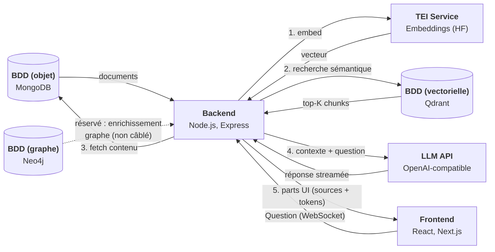

# Architecture Murphy

## Vue d'ensemble

Les bases de données sont supposées **pré-peuplées** : il n'y a pas de pipeline
d'ingestion dans ce dépôt (la phase de seeding LEGIFRANCE vit ailleurs). Neo4j est
provisionné dans Docker Compose mais **n'est pas encore branché** sur le chemin de requête.

## Principes de conception

- **Stateless** : chaque requête recompute tout le pipeline. Aucun historique
  conversationnel stocké côté serveur, aucune session.
- **Fail-fast** : pas de retry automatique. En cas d'échec d'une étape, l'erreur remonte
  clairement (`RagError` avec `stage` = `embedding` | `retrieval` | `llm`).
- **Observabilité** : logs structurés Pino (JSON) par module, et métriques de latence
  par étape (`ragTiming`) renvoyées au client dans la part `finish`.

## Le pipeline RAG

Cœur du système : `backend/src/services/chatService.ts:createChatStream`. Étapes :

1. **Extraction de la question** — dernier message `user`, parts `text` concaténées
   (`extractQuestionFromMessages`). La requête porte un tableau `messages` (format AI SDK),
   pas une chaîne `question`.
2. **Embedding** (`ragService.embedQuestion`) → service TEI.
3. **Retrieval** (`ragService.retrieveChunks`) → Qdrant, top-K
   (`RETRIEVAL_TOP_K`, défaut 5), avec seuil `RETRIEVAL_MIN_SCORE` (défaut 0.5).
4. **Streaming des sources** — chaque hit Qdrant est écrit comme part `data-document`
   **avant l'appel LLM**, pour affichage immédiat.
5. **Fetch du contenu** (`ragService.fetchChunkDocuments`) → MongoDB, par `chunkId`.
   Ce contenu ne sert qu'à construire le contexte LLM ; il n'est jamais renvoyé tel quel.
6. **Streaming LLM** — contexte injecté dans le system prompt (`getDefaultSystemPrompt`,
   prompt d'assistant juridique français, surchargeable via `SYSTEM_PROMPT`), puis les
   tokens de `llmProvider.stream()` sont écrits comme parts `text-delta`.
7. **Finish** — part `finish` portant `ragTiming` (latence par étape).

Le flux est construit avec le **Vercel AI SDK** (`createUIMessageStream`). Le contrat de
parts est `AppUIMessage` (`backend/src/types/messages.ts`) ; il doit rester synchronisé
avec le frontend.

### Trois transports, un seul pipeline

`createChatStream` produit un flux consommé de trois façons :

- **WebSocket** `/api/v1/chat/ws` (`routes/chatWebSocket.ts`) — utilisé par le frontend.
- **POST** `/api/v1/chat/streams` (SSE) et **POST** `/api/v1/chat/completions`
  (draine le flux en une réponse JSON) — `routes/chat.ts`, pour tests / clients non-WS.

Toute évolution du pipeline se fait dans `createChatStream` ; les trois chemins en héritent.

## Composants

### Frontend (Next.js 16 / React 19 / Tailwind v4)
- `MainPanel.tsx`, `ChatBox.tsx`, composants `chat/` — interface conversationnelle.
- Hook `useRagChat.ts` : `WebSocketChatTransport` custom branché sur `useChat`
  (`@ai-sdk/react`). Une question envoyée, un flux de parts JSON reçu.
- Store `zustand` pour l'état UI.

### Backend (Express 5 / TypeScript)
- **Routes** (`/api/v1`) : `chat` (streams/completions), `chatWebSocket` (ws),
  `health` (+ `/services`), `documents`.
- **Services** : `chatService` (orchestration) et `ragService` (helpers embedding /
  retrieval / fetch / construction de contexte).
- **Middleware** (ordre dans `app.ts`) : requestLogger → helmet / rate-limit / CORS
  (`security.ts`) → body parsing → routes → `notFoundHandler` + `errorHandler`. La route
  de stream ajoute `streamRateLimiter` + validation.
- **Conventions** : réponses via `buildApiResponse`, logger enfant Pino par module
  (`rootLogger.child({ context })`), handlers async enveloppés par `asyncHandler`.

### Clients d'infrastructure (`backend/src/infra/`)
- `EmbeddingClient` (TEI), `QdrantVectorClient`, `LLMProvider` (API OpenAI-compatible),
  client MongoDB.
- Le barrel `infra/index.ts` expose `embeddingClient`, `qdrantClient`, `llmProvider`
  comme **singletons paresseux** (via `Proxy`) — instanciés au premier accès, réutilisés.
- MongoDB fait exception : `initMongoClient()` au boot (`server.ts`) et `closeMongoClient()`
  au shutdown gracieux.

### Bases de données

| Base    | Rôle | Détails |
|---------|------|---------|
| MongoDB | Contenu des chunks (pour le contexte LLM) | Collection `MONGODB_COLLECTION` (défaut `chunks`), fetch par `chunkId` |
| Qdrant  | Index vectoriel | Recherche cosine, top-K, seuil `RETRIEVAL_MIN_SCORE`, payload `chunkId/title/type` |
| Neo4j   | Graphe (réservé) | Provisionné mais non branché sur le chemin de requête |

### Services externes

- **TEI (Text Embeddings Inference)** — image HuggingFace, endpoint `POST /v1/embeddings`,
  pooling mean, modèle `EMBEDDING_MODEL`. Requiert un **GPU NVIDIA** (déclaré dans
  `docker-compose.dev.yml`).
- **LLM** — API OpenAI-compatible (type Mammouth.AI), streaming `stream: true`. Endpoint,
  clé, modèle, température, max tokens et timeout configurés par variables d'environnement.

## Stack technique

| Couche | Technologie | Version (réf.) |
|--------|-------------|----------------|
| Frontend | Next.js + React + Tailwind | next 16, react 19, tailwind v4 |
| Backend | Express + TypeScript | express 5, ai (SDK) 6 |
| Temps réel | WebSocket (`ws`) + SSE | — |
| Embeddings | TEI (HuggingFace) | image `text-embeddings-inference:cuda-1.8.1` |
| Vector store | Qdrant | v1.16.3 |
| Document store | MongoDB | 8.2 |
| Graph DB | Neo4j (réservé) | 2025.09.0 |
| LLM | API OpenAI-compatible | — |

Voir [DEPENDENCIES.md](DEPENDENCIES.md) pour la liste complète des paquets et images.

## Évolution future

Voir [ROADMAP.md](ROADMAP.md) et [BETA.md](BETA.md). Pistes principales : câblage de Neo4j
pour l'enrichissement de contexte, A/B testing prompt/retrieval, authentification (OAuth 2.0),
métriques sans contenu, re-ranking.
