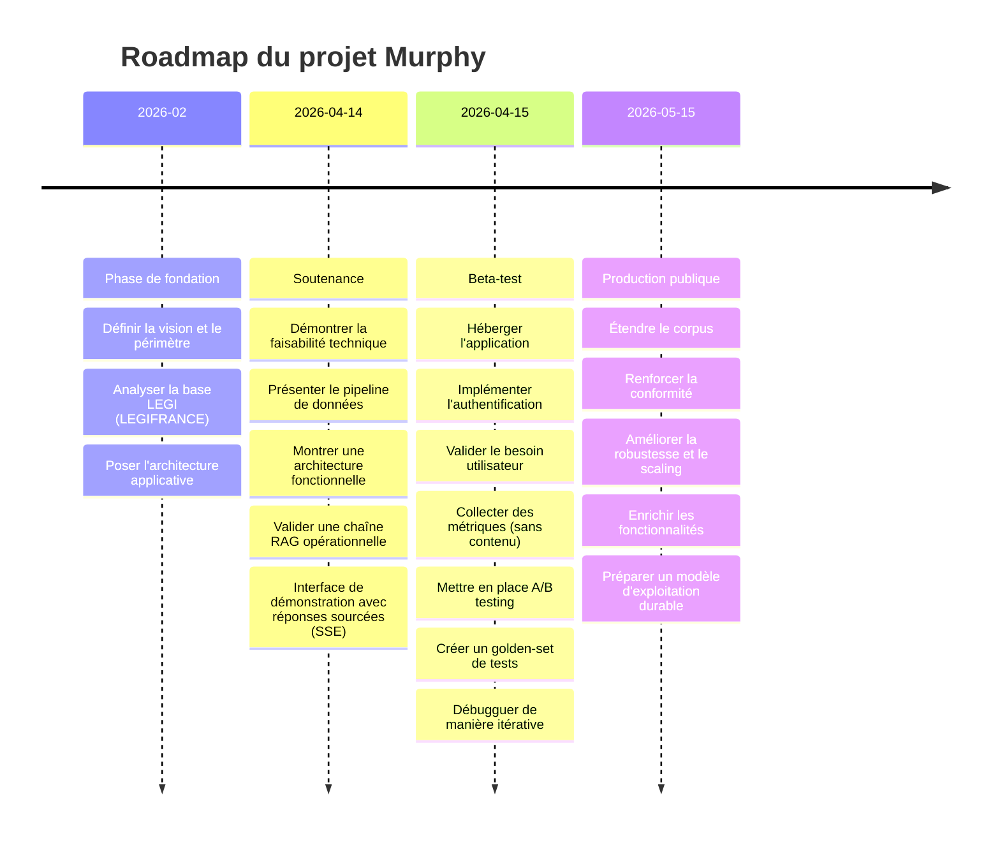

## Roadmap de Murphy

### 1. Phase de fondation
Objectif : cadrer le projet et construire le socle technique et documentaire.

Cette phase regroupe :
- la définition de la vision et du périmètre ;
- l'analyse préliminaire de la base LEGI de LEGIFRANCE 
- les premiers choix d’architecture applicative.

Elle permet de passer d’une idée de produit à une base techniquement exploitable.

### 2. Jalon : Soutenance
Objectif : démontrer la faisabilité technique et la cohérence du projet.

À ce stade, Murphy doit montrer :
- la mise en place du pipeline de données ;
- une architecture fonctionnelle ;
- une chaîne RAG exploitable ;
- une interface de démonstration capable de produire une réponse avec sources (streaming SSE) 

La soutenance valide donc un **socle viable**, pas un produit fini.

### 3. Jalon : Beta-test
Objectif : transformer la base en application testable par de vrais utilisateurs.

Cette phase vise à :
- faire heberger l'application
- valider le besoin et l'experience utilisateur
- implémenter l’authentification ;
- collecter des métriques sans collecte de contenu ;
- profiter de l’évaluation comparative A/B ;
- améliorer les test automatiques avec la création d'un golden-set 
- débugguer par processus itérratif

La beta valide la **valeur d’usage** et la **qualité de l’expérience**.

### 4. Jalon : Production publique
Objectif : industrialiser Murphy pour une ouverture plus large.

Cette phase correspond à :
- l’extension du corpus ;
- le renforcement de la conformité ;
- l’amélioration de la robustesse et du passage à l’échelle ;
- l’enrichissement des fonctionnalités ;
- la préparation d’un modèle d’exploitation durable.

La production publique marque le passage d’un produit testé à un **service juridique d’information réellement exploitable**.

## Synthèse

