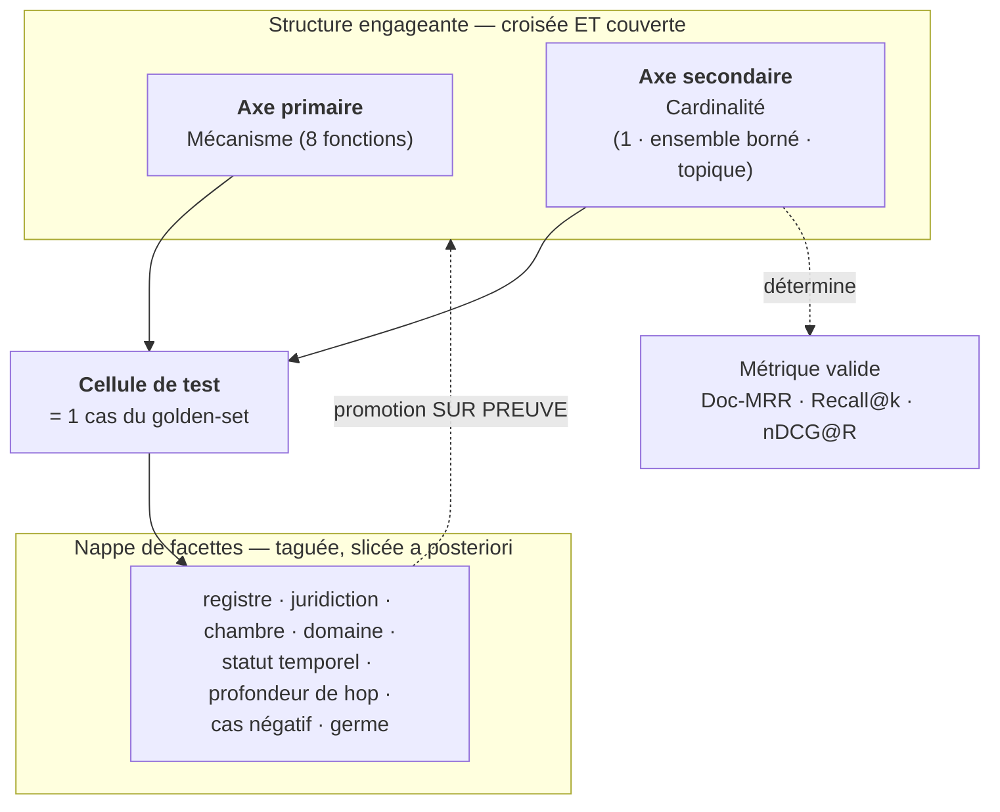

# SYNTHÈSE — Cadre structurant de l'évaluation de la récupération

/!\ Partiellement divergent

> ⚠️ **Péremption précisée le 2 août 2026.** Ce document reproduit **la grille
> d'ADR-033** (deux axes, quatorze cellules, *« chaque cellule déclare sa
> métrique »*, mapping `Doc-MRR / Recall@k / nDCG@R`). **ADR-033 est obsolète**,
> et trois de ses pièces sont mortes séparément :
>
> - l'**axe cardinalité** est **dissous** — il empilait un compte (`R = len(qrels)`)
>   et une clôture (la gratuité du label)
>   ([#3](https://github.com/left-eyebr0w/murphy/issues/3)) ;
> - **`nDCG@R` est retiré** — il ne s'appliquait qu'à la branche ouverte, seul
>   endroit où `R` est indisponible
>   ([#14](https://github.com/left-eyebr0w/murphy/issues/14)). La métrique de
>   comparaison est `RBP(p) + résidu`
>   ([ADR-007](../../product/ADR/ADR-007-metrique-rbp-residu.md)) ;
> - il n'y a **pas de `Recall@k`** dans ce dispositif, et il n'y en a jamais eu.
>
> Le socle de remplacement est ADR-035, puis ADR-036 ; il se construit sur la
> carte [#1](https://github.com/left-eyebr0w/murphy/issues/1). **En cas de
> contradiction avec un ADR ou avec `GOLDEN-SET.md`, ce document a tort.**

> Synthèse de **session de travail** (source éphémère au sens `PILOTAGE.md` §4) :
> fixe les **axes et tags** du golden-set, en amont de leur formalisation dans
> `CADRAGE_evaluation` et de leur exécution (B-08 ; exigences E-P2-06 / E-P2-07 /
> E-P2-08). Le contenu utile est à **reverser** dans les documents pérennes,
> puis ce document est archivé.
>
> **Convention** : ✅ = tranché en session · 🔶 = proposé à valider ·
> ⬜ = ouvert (→ décision / ADR).
>
> **Rattachement** : ADR-017 (strates), ADR-007 (métriques), ADR-009
> (stratification), ADR-012 (capacités, pas dates), ADR-018 (identité
> canonique), ADR-003 (vagues DILA), R-05 (biais golden-set solo).

---

## 1. Introduction

### 1.1 Le problème, correctement posé

La difficulté initiale était mal cadrée, non insoluble. Chercher à organiser
l'évaluation par **contenu** — thématiques, domaines, institutions, logiques du
droit — pose un problème *wicked* : l'espace est non borné, sans complétion
naturelle, et le produit combinatoire (domaines × institutions × logiques × …)
explose. Tant que le contenu est l'axe primaire, on reste face à un espace
infini.

**La sortie** : basculer l'axe primaire sur la **capacité de récupération
exercée** — un ensemble *énumérable et petit* — et reléguer le contenu au rang
de **facettes** qu'on étiquette (et qu'on *slice* a posteriori), jamais qu'on
énumère. La wickedness reste confinée à une seule dimension, et cette dimension
devient de l'**échantillonnage stratifié**, pas une exigence d'exhaustivité.

### 1.2 « Unit-test » : deux familles à ne pas confondre

Le vocabulaire du test unitaire (isoler *un* comportement, réponse attendue
*déterministe*) scinde le besoin en deux familles :

- **Known-item auto-étiquetés** (déterministes, sans annotation) — la requête est
  *construite à partir* d'un document cible : le label est gratuit et objectif.
  Citer verbatim l'article 1240 du Code civil ⇒ le système *doit* le rendre au
  rang 1. **Aucun jugement de pertinence ⇒ R-05 esquivé par construction** : le
  label n'est pas une intuition, c'est un fait d'authoring.
- **Sondes de pertinence graduée** (« quelle bonne source pour ce besoin ? ») —
  jugement requis, coûteux, **réintroduit R-05**. C'est le matériau des boucles
  experts (alpha ph.2), pas du point de départ.

### 1.3 Point de départ retenu ✅

La **famille known-item déterministe**. Objective, labels gratuits, immédiatement
utile comme **filet de non-régression**, elle *front-load* les strates pas chères
d'ADR-017. Le gradué topique est réservé aux boucles experts.

---

## 2. Axe primaire — le mécanisme de récupération

La colonne vertébrale. On ne teste pas *un contenu*, on teste *une fonction de
récupération*. Énumération de travail (🔶 — première liste, destinée à évoluer) :

| # | Mécanisme | Nature du test |
|---|-----------|----------------|
| 1 | **Correspondance littérale** | requête = texte source verbatim |
| 2 | **Résolution de référence** | « article 1240 du Code civil » → l'article (ELI) |
| 3 | **Known-item par identifiant** | ECLI, numéro de pourvoi → la décision |
| 4 | **Robustesse à la paraphrase** | reformulation → même cible |
| 5 | **Concept → instance** | notion juridique → l'article qui la fonde |
| 6 | **Multi-hop / graph-hop** | cible atteignable seulement via une citation |
| 7 | **Désambiguïsation** | « prescription » pénale vs civile ; homonymes inter-domaines |
| 8 | **Absence / négatif** | besoin hors corpus → *fail-fast*, pas de pertinence hallucinée |

Chaque item est une « fonction » testable au sens logiciel.

### 2.1 Garde-fou « logique » ✅

La récupération **ne raisonne pas** (invariant `VISION.md`). Un test « logique »
n'évalue donc *jamais* si le système déduit correctement ; il vérifie si la
récupération **ramène l'ensemble** des documents qu'un juriste devrait avoir sous
les yeux. « Principe + exception » n'est pas un test de raisonnement : c'est une
propriété de **recall d'ensemble**. Cette distinction interdit le *scope creep*
vers « le système a-t-il raison en droit », hors périmètre P2.

### 2.2 Continuité avec l'existant

On n'invente pas ex nihilo : les mécanismes **1–3 et 8** sont proches de la
**strate 1** (invariants structurels) ; le **6** relève de la **strate 2** /
des sets graph-hop (E-P2-08). L'apport propre de la session est de **nommer une
famille *cheap* supplémentaire** — les known-item auto-étiquetés — qui avance
l'objectivité au plus tôt.

### 2.3 Discipline d'authoring ✅

La suite doit contenir des **cas qu'on s'attend à voir échouer**. Une suite
réussie à 100 % par la baseline a un pouvoir discriminant nul et ne mesure aucune
marge de progression. On écrit délibérément des cas de stress (paraphrase
agressive, graph-hop profond, homonymes) *à côté* des cas triviaux.

---

## 3. Axe secondaire — la cardinalité du golden-set ✅

### 3.1 Deux *sortes* d'axe secondaire

Un axe secondaire peut faire l'un de deux travaux distincts :

- changer le **comportement** du système → sert la **localisation des pannes**
  (meilleur candidat : *registre / provenance*, cf. §4) ;
- changer la **mesure** → détermine **quelle métrique est valide** dans chaque
  cellule (meilleur candidat : *cardinalité*).

**Choix retenu : la cardinalité du golden-set.** Pour la v0, dont le job est un
*harnais baseline reproductible*, la **validité de mesure** prime — et les
métriques existent déjà (ADR-007), donc zéro machinerie neuve.

### 3.2 Les trois niveaux et leur métrique

Faire de la cardinalité un axe *explicite* **interdit mécaniquement** l'erreur
« nDCG@R partout » : chaque cellule **déclare sa propre métrique**.

| Cardinalité | Nature du besoin | Métrique de la cellule | Machinerie |
|-------------|------------------|------------------------|------------|
| **1 — cible unique** | known-item, référence résolue | **Doc-MRR** / lecture *success@1* | existante (ADR-007) |
| **Ensemble borné requis** | conjonctif (principe + exception) | **Recall@k** / succès tout-ou-rien | existante |
| **Topique ouvert** | pertinence graduée | **nDCG@R** (+ diagnostics) | existante (primaire) |

> *success@1* se lit sur Doc-MRR (rang de la première cible) : **aucune métrique
> nouvelle à implémenter**, seulement de l'*authoring* discipliné par cellule.

### 3.3 Réserve d'orthogonalité 🔶

La cardinalité **corrèle partiellement** avec le mécanisme (un known-item *est*
de cardinalité 1). Elle n'est donc pas parfaitement orthogonale à l'axe primaire.
C'est acceptable : la corrélation n'annule pas l'utilité (chaque cellule reste
métriquement valide), mais elle est à **garder en tête** au moment de peupler la
grille pour ne pas dupliquer des cas.

### 3.4 Règle de discipline ✅

**Un seul axe secondaire engageant à la fois.** Un axe se *croise et se couvre*
(coût combinatoire d'authoring) ; une facette se *tague et se slice* (quasi
gratuit). Un deuxième axe engageant recréerait la grille infinie qu'on vient
d'éviter. Tout ce qui n'est pas la cardinalité **reste facette** (§4).

Filtres pour mériter le statut d'axe : **orthogonalité** au primaire ·
**interaction** forte (le mécanisme se comporte différemment selon les niveaux) ·
**bornage** (petit et clos) · **localité diagnostique** (un échec pointe une
réparation).

### 3.5 Promotion sur preuve ✅

Les facettes sont **promouvables en axes** — mais *sur preuve chiffrée*
d'interaction, pas a priori. On tague tout dès le départ (gratuit) ; on ne
*promeut* une facette au rang d'axe que quand les nombres montrent que le
mécanisme interagit avec elle. C'est ADR-012 appliqué à l'évaluation : un
changement d'état est un **constat sur preuves**, jamais une pré-décision.

---

## 4. Tags (facettes)

### 4.1 La question de tri

La bonne question n'est pas « ce tag est-il pertinent ? » (tout l'est vaguement)
mais **d'où vient sa valeur ?** — car la source détermine le coût *et* le risque
R-05. Trois sources, par désirabilité décroissante :

1. **Dérivé de l'identité canonique** — une fonction déterministe lit le tag
   depuis l'ECLI / l'ELI / la structure du document. Gratuit, objectif,
   **permanent** (survit à la ré-ingestion). *Le tag idéal.*
2. **Détenu par construction** — la valeur est connue parce qu'on a *fabriqué* le
   test (profondeur de hop, cas négatif, doc germe). Gratuit et objectif.
3. **Jugé** — arbitrage de pertinence ou de difficulté requis. Cher, R-05.
   **Banni en v0.**

### 4.2 Règle d'admission ✅

Un tag mérite sa place **ssi** : (1) il est **dérivé ou détenu**, jamais jugé ;
(2) on peut **nommer la question** de diagnostic ou de couverture qu'on
répondrait en *slice*-ant dessus — pas de question, pas de tag ; (3) son
**vocabulaire est clos** et le **null est permis** (forcer une valeur pour
éviter un trou réintroduit R-05).

### 4.3 Le soulagement : DILA a déjà étiqueté le contenu

Les trois angles *wicked* du départ — thématiques, domaines, institutions — sont
**déjà encodés dans la structure du corpus DILA**, donc dérivables et quasi
gratuits. La juridiction est dans l'ECLI ; la chambre/formation dans les
métadonnées ; le domaine est lisible depuis le code (LEGI) ou la chambre (CASS).
**On ne les énumère pas : on les lit sur l'identité canonique.** La wickedness de
contenu disparaît non pas parce qu'on l'épuise, mais parce que DILA l'a déjà
étiquetée.

### 4.4 Set curé 🔶

**Dérivés de l'identité (tagués dès le jour 1) :**

| Tag | Question répondue en *slice*-ant | Vocabulaire | Note |
|-----|----------------------------------|-------------|------|
| **Registre / provenance** | le mécanisme dégrade-t-il selon droit positif vs jurisprudence ? | positif / jurisprudence / (JORF-KALI +tard) | **Candidat n°1 à la promotion en axe** ; grandit au rythme des vagues (ADR-003) |
| **Juridiction émettrice** | quelle institution le système sert-il mal ? | clos (ECLI) | les « institutions » |
| **Chambre / formation** | quel domaine (proxy) ou formation décroche ? | clos (métadonnées) | **Candidat n°2** + proxy de domaine en jurisprudence |
| **Domaine juridique** | couverture par domaine ? | clos, **null si non dérivable** | les « thématiques », dé-wickedisées |
| **Statut temporel** | régression sur l'abrogé / le mort-né ? | en vigueur / abrogé / mort-né (`succeeded_by`) | alimente le futur set diagnostique temporel |

**Détenus par construction (tagués par l'authoring) :**

| Tag | Rôle | Vocabulaire |
|-----|------|-------------|
| **Profondeur de hop** | courbe de dégradation par hop (or diagnostique du multi-hop) | 0 / 1 / 2+ |
| **Cas négatif** | *slice* des hors-corpus *à l'intérieur* d'un autre mécanisme | booléen |
| **Doc(s) germe** | provenance rendant le label auto-étiqueté rejouable | référence(s) |

### 4.5 Deux pièges traités explicitement ✅

- **Le null est une valeur de première classe**, pas un trou. Le droit non
  codifié → domaine `null`, jamais deviné. Le rapport affichera « X % des cas
  portent un domaine » — et *ce pourcentage est lui-même une information*. Forcer
  un domaine = le jugement arbitraire que R-05 interdit.
- **La difficulté ne se tague pas en entrée** (subjective → R-05). On la *reframe
  en sortie* : un cas que la baseline rate est *de facto* difficile. La difficulté
  devient un **label calculé par le harnais**, pas asserté. Mesurer plutôt
  qu'affirmer — ADR-012 poussé jusqu'au tag.

---

## 5. Synthèse

### 5.1 Architecture d'ensemble

### 5.2 Registre des décisions de session

| Objet | Décision | Statut |
|-------|----------|--------|
| Axe primaire | mécanisme de récupération exercé (≠ contenu) | ✅ |
| Énumération des mécanismes | 8 fonctions (liste de travail) | 🔶 |
| Garde-fou « logique » | recall d'ensemble, jamais raisonnement | ✅ |
| Point de départ | famille known-item déterministe (auto-étiquetée) | ✅ |
| Axe secondaire | **cardinalité du golden-set** | ✅ |
| Mapping cardinalité → métrique | Doc-MRR / Recall@k / nDCG@R, sans machinerie neuve | ✅ |
| Discipline d'axe | un seul axe secondaire engageant à la fois | ✅ |
| Promotion facette → axe | sur preuve chiffrée d'interaction (ADR-012) | ✅ |
| Set de tags | dérivés de l'identité + détenus par construction | 🔶 |
| Null | valeur de première classe | ✅ |
| Difficulté | label calculé en sortie, jamais tagué en entrée | ✅ |

### 5.3 Décision ouverte bloquante ⬜

**Réconciliation avec ADR-009.** E-P2-07 impose déjà une **stratification en
4 types d'action** (100 % de couverture) : c'est *déjà* une facette obligatoire
câblée. Avant de figer un schéma d'enregistrement des cas de test, il faut
trancher si ces 4 types d'action sont :

- **(a)** l'axe primaire « mécanisme » sous un autre nom (⇒ tout se range, la
  stratification existante *est* l'énumération des mécanismes) ;
- **(b)** une troisième dimension à réconcilier (⇒ subordonner l'une à l'autre) ;
- **(c)** une facette parmi les autres.

Cette réconciliation est le **préalable** au schéma de cas (id · germe ·
mécanisme · cardinalité · qrels · tags dérivés/construits) qui alimentera B-08.
*(ADR-009 et `CADRAGE_evaluation` non disponibles en session — à confronter.)*

### 5.4 Ce que ça alimente

- **`CADRAGE_evaluation`** — reversement des §2–4 ci-dessus ; contribue aux
  décisions §9 (unité documentaire, échelle, agrégation, k, formats).
- **B-08** (`BACKLOG.md`) — golden-set v1 + guide + stratification : le schéma de
  cas et le set de tags en sont la spécification directe.
- **E-P2-06 / E-P2-07 / E-P2-08** — grades 0–3, stratification, set graph-hop :
  tous cadrés par les axes et tags ci-dessus.
