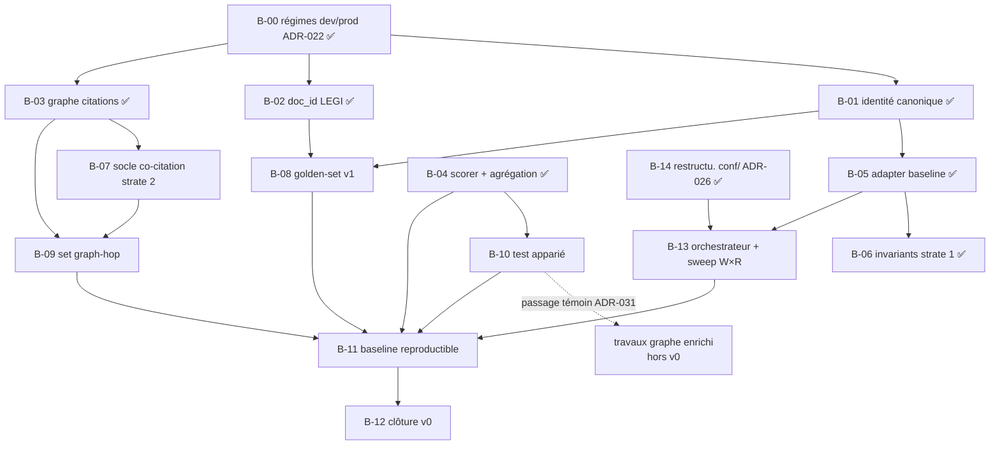

# BACKLOG — Version en cours : v0

> Work Plan du programme (`HANDBOOK.md` §2), régi par les règles de
> `PILOTAGE.md` §2 : **ordonné par les exigences de sortie de la
> version en cours** (`EXIGENCES_v0.md`), repriorisé à chaque revue
> bimensuelle. Un item qui ne sert aucune exigence sort du backlog
> (→ §4). WIP : **2 items 🔶 maximum** (`HANDBOOK.md` §3).
>
> État au 18 juillet 2026 (clôture B-00), amorcé depuis `STATUS.md`.

## 1. Backlog ordonné

| # | Item | Exigence(s) servie(s) | Projet | Statut |
|---|---|---|---|---|
| B-00 | Implémenter les régimes d'ingestion dev/prod (ADR-022, amendé ADR-023/024) : hydratation Neo4j, fin des unknowns, aplatissement par chemin complet, épuration Mongo + bump `SCHEMA_VERSION`, interrupteur d'embedding en dev (ADR-023, remplace les toggles par store), audit en conf. Échantillonnage corpus retiré (ADR-024 : sans objet ; corpus témoin → B-02) | E-P1-02, E-P1-03, E-P1-04 (prérequis) | P1 | ✅ |
| B-01 | Vérifier l'identité canonique croisée sur les 3 BDD | E-P1-02 | P1 | ✅ |
| B-02 | Vérifier la stabilité du `doc_id` article LEGI (test de ré-ingestion) | E-P1-03 | P1 | ✅ |
| B-03 | Modéliser complètement le graphe de citations Neo4j (relations typées) | E-P1-04 | P1 | ✅ |
| B-04 | Implémenter le scorer nDCG@R + diagnostics + règle d'agrégation chunk→document | E-P2-02, E-P2-03 | P2 | ✅ |
| B-05 | Implémenter l'adapter baseline (runs au format ADR-008) | E-P2-01, E-T-01 | P2 | ✅ |
| B-06 | Implémenter la suite d'invariants structurels (strate 1) | E-P2-04 | P2 | ✅ |
| B-07 | Miner le jeu de **paires de co-citation** (strate 2) depuis le graphe — socle d'extraction (adapter Neo4j dédié dans `eval/`, Cypher, writer des paires), usage diagnostique précision-seulement, **non des qrels** (ADR-029) | E-P2-05 | P2 | ✅ |
| B-08 | Produire le golden-set v1 synthétique + guide d'annotation + stratification sur l'**axe unique des mécanismes de récupération** (opérations conservées comme facettes d'arête — ADR-030). ⚠️ **La spécification est en cours de refonte** sur la carte [Golden-set v1 — spécification prête à l'authoring](https://github.com/left-eyebr0w/murphy/issues/1) et atterrira en **ADR-035** ; ADR-033 (deux axes, 14 cellules) est **obsolète**. Aucun authoring avant clôture de la carte | E-P2-06, E-P2-07 | P2 | ⬜ |
| B-09 | Construire ≥ 1 set diagnostique graph-hop | E-P2-08 | P2 | ⬜ |
| B-10 | Implémenter le test statistique apparié | E-P2-09 | P2 | ⬜ |
| B-11 | Produire la baseline chiffrée reproductible (double run **(W, R)**, artefacts versionnés) | E-P2-10, E-T-02 | P2 | ⬜ |
| B-12 | Mini-ADR de clôture v0 (constat sur preuves) | §5 `EXIGENCES_v0.md` | — | ⬜ |
| B-13 | Orchestrateur d'ingestion + sweep `W×R` (sous-processus `kedro run --params W`, séquentiel, `nuke` entre `W`, reprise sur incident) — plateforme end-to-end (ADR-027) | E-P2-10 (étendue) | P2 | ⬜ |
| B-14 | Restructurer `conf/` en partition `workflow / ingestion / evaluation` (ADR-026), fingerprint inchangé (test de non-régression) | E-P2-10 (prérequis couplage) | P1 | ✅ |

## 2. Notes d'ordonnancement

- **B-00 est ✅** : prouvé par deux runs `kedro run` réels (7/7 nœuds,
  statut `ok`, équation de complétude exacte 1121 = 1121 = 1121), bases
  vérifiées champ par champ (Mongo épuré `SCHEMA_VERSION` 2, Neo4j
  hydraté, Qdrant vecteurs non nuls).
- **B-01, B-02 et B-03 sont ✅** (revue du 19 juillet 2026) : identité
  canonique croisée vérifiée sur les 3 BDD, `doc_id` LEGI stable
  confirmé par test de ré-ingestion, graphe de citations Neo4j modélisé
  complètement (chaîne datée `succeeded_by` posée dès B-00, puis autres
  verbes de citation typés et cibles absentes résolues). Constat porté
  par le porteur du programme ; **aucun rapport/artefact versionné
  encore référencé** pour E-P1-02/03/04 malgré la vérification exigée
  par `EXIGENCES_v0.md` — à régulariser avant la clôture v0 (B-12) si
  jugé nécessaire.
- **B-04 est ✅** : scorer nDCG@R (coupe adaptative maison, gain injectable —
  exponentiel par défaut, linéaire en diagnostic) + agrégation chunk→document
  (ADR-006, max qrels / rang du 1er chunk runs) + diagnostics (R-Precision,
  Recall@2R, Doc-Recall@R maison ; MAP, Doc-MRR via `ranx`, ADR-027).
  **Localisation révisée** : nouveau projet dédié `eval/` (dossier in-repo
  pour l'instant, extraction en submodule différée), et non un sous-paquet de
  `data/` comme prévu à la revue du 19 juillet 2026 — fidèle à ADR-027 (P2
  pilote l'ingestion par sous-processus, sans importer `ragcore`). Oracle
  primaire *auto pur* (ADR-028) : cas jouets calculés à la main
  (`tests/golden/`), cross-check `trec_eval`/`pytrec_eval` secondaire et hors
  CI par défaut (`tests/oracle/`). Suite verte (54 tests), mypy strict et
  ruff propres. Constat empirique notable : `pytrec_eval`'s `ndcg_cut` est en
  gain linéaire, pas exponentiel — documenté dans le code du cross-check.
- **B-05 est ✅** : adapter baseline (config dense de référence) dans `eval/`,
  contrat ADR-016 `requête → IDs ordonnés`. Chemin de lecture Qdrant/TEI/Mongo
  **dédié, sans import de `ragcore`** (ADR-027). Constat clé de l'exploration :
  le `doc_id` canonique est **gratuit** — l'ingestion l'écrit dans le payload
  Qdrant (clé `identifier`, ADR-018), donc une recherche `with_payload` le
  remonte sans aucun aller-retour Mongo ; il est copié tel quel dans
  `RunEntry.doc_id`. Nom de collection lu du pointeur `MURPHY_META`
  (comme le backend). Writer JSONL immuable `dump_jsonl_run` (round-trip vérifié
  avec le loader existant). Ports `Retriever`/`Embedder`/`Searcher` (couture
  B-13). Suite : 75 tests unit/golden verts + 1 test `integration`
  (testcontainers Qdrant, hors CI), mypy strict et ruff propres. **B-06 et B-13
  deviennent tirables** côté prérequis B-05.
- **B-06 est ✅** : suite d'invariants structurels de strate 1 (ADR-017),
  part **pure** — `eval/src/murphy_eval/core/services/invariants.py`, aucune
  base de données. Collecte les `Violation` d'un run/qrels (rangs contigus +
  uniques, pas de doublon `(query_id, chunk_id)`, ids non vides, espaces de
  nommage `doc_id` run↔qrels compatibles) et les branche en option sur les
  loaders JSONL (`validate=True` → `InvariantError`). Suite `unit` verte en
  CI (94 tests), mypy strict et ruff propres — satisfait E-P2-04. **Décision
  de périmètre** : complétude et intégrité des liens Neo4j (strate 1 *live*,
  sur BDD peuplées) restent hors v0, déjà couvertes côté `data/` (B-00/B-01/
  B-03) ; les re-faire ici serait un doublon. Ce que B-06 régularise : la
  preuve mécanique versionnée que les artefacts sont structurellement sains.
- **B-07 recadré (ADR-029, 20 juillet 2026)** : l'hypothèse *citation ≈
  pertinence* est rétrogradée. La strate 2 n'est plus une source de
  **qrels scorables** mais un **diagnostic de co-citation
  précision-seulement** (on mesure la part de documents remontés
  juridiquement liés dans le graphe ; jamais le rappel, jamais un grade —
  neutralise l'incomplétude des citations et l'absence de degré). B-07
  subsiste comme **socle d'extraction** (premier chemin de lecture Neo4j
  du harnais, hors `ragcore` — ADR-027) et **B-09 le consomme**
  (`B-07 → B-09`). Le graphe **n'assiste pas** la construction du
  golden-set (B-08 reste indépendant) : ce serait la circularité même que
  la strate 2 doit prévenir. L'assistance à l'annotation est renvoyée en
  §4, hors graphe.
- **B-07 est ✅ (22 juillet 2026)** : socle d'extraction livré dans `eval/` —
  adapter Neo4j dédié (hors `ragcore`, ADR-027), Cypher contraint aux labels
  documentaires, writer JSONL immuable, volumétrie (`summarize_pairs`) et
  commande `murphy-eval-cocitation` (`[project.scripts]`). **Jeu réel produit et
  versionné** dans `eval/artifacts/cocitation/` : 1456 paires, 726 documents,
  reproductible bit-à-bit (md5 identiques sur deux runs). Filtres prouvés contre
  un vrai Neo4j (testcontainers) ; 110 tests unitaires + 2 d'intégration.
  E-P2-05 satisfaite (jeu versionné + volumétrie + méthode documentées),
  E-T-02 servie (procédure de rejeu au README). **Deux défauts trouvés par le
  run réel, invisibles aux tests** : le tenant codé en dur (`"system"` au lieu
  d'`OWNER_ID`) qui rendait un jeu vide en code 0, corrigé ; et le sort de
  `contains`, à trancher avant B-09 (ci-dessous).
- **B-07 — contrôle de volumétrie ✅ LEVÉ (22 juillet 2026).** Mesuré sur le
  graphe réellement ingéré (1121 nœuds, tenant `default`) : **1456 paires avec
  le filtre de labels, 1456 sans** — chiffres identiques, C-01 était bien
  *latent* et `_DOCUMENT_LABELS` est exhaustif. Les labels observés sont
  exactement les quatre attendus (`Article` 384, `Document` 352, `Section` 287,
  `Texte` 98), aucun autre. La réserve ci-dessous est donc close ; elle est
  conservée pour mémoire de la méthode.
  

Énoncé initial de la réserve

  Le Cypher
  de minage contraint les labels documentaires (`Document | Article | Texte |
  Section`, recopiés depuis le contrat d'ingestion — ADR-027 interdit
  d'importer `ragcore`). L'exhaustivité de cette liste est **déduite de la
  lecture de `merge_document_node`, non mesurée sur un corpus** : les tests
  d'intégration ne la prouvent pas, leur seed portant les labels attendus par
  construction. Contrôle à faire dès que B-07 est exécutable de bout en bout
  (C-04) sur un Neo4j réellement ingéré : **compter les paires avec et sans le
  filtre de labels — les deux chiffres doivent être identiques**. Un écart
  signalerait un label documentaire non recensé, donc un filtre qui *supprime
  des paires légitimes* en silence — défaut inverse et plus grave que celui
  qu'il corrige, puisqu'il appauvrirait le jeu sans lever d'erreur. Sert
  E-P2-05 (volumétrie documentée) : à solder avant de clore B-07.
  

- **B-07 → B-09 : le verbe `contains` est à trancher (constat du 22 juillet
  2026).** Le premier jeu réel compte **1456 paires, dont 726 `contains`** — la
  moitié. Or `contains` est de la **structure documentaire**, pas une citation :
  `Section→Article` (395), `Section→Section` (269), `Texte→Section` (48),
  `Texte→Article` (14). ADR-029 fonde la strate 2 sur des documents
  *juridiquement liés* ; un couple parent/enfant ne l'est pas, et le garder
  gonflerait la précision diagnostique de B-09 avec des paires triviales
  (retrouver un article et le code qui le contient n'est pas une performance de
  récupération). Ventilation restante, elle bien citationnelle : `cites` 373,
  `succeeded_by` 288, `references` 62, `modifies` 7. **Décision à prendre avant
  B-09** : filtrer `contains` au minage, ou le laisser passer et le neutraliser
  au moment du diagnostic (ADR-029 déporte déjà le jugement des verbes sur
  B-09). Ne remet pas en cause le socle : le jeu est reproductible et sa méthode
  documentée ; c'est son *interprétation* qui est en jeu.
- **B-05 n'a pas de point d'entrée** (constaté en outillant B-07, 22 juillet
  2026). `BaselineRetriever` n'est câblé par aucun composeur : produire un run
  baseline demande encore d'écrire du Python à la main, alors qu'E-T-02 veut une
  procédure de rejeu documentée. B-07 a posé le patron (`murphy_eval/cli/`,
  `[project.scripts]`, artefacts versionnés sous `eval/artifacts/`) ; reste à
  l'appliquer à B-05. À solder au plus tard dans **B-11** (baseline chiffrée
  reproductible), qui ne peut pas s'en passer.
- B-08 (golden-set) est désormais tirable : B-01 et B-02 sont acquis.
- **B-08 recadré une seconde fois (ADR-033, 31 juillet 2026)** — les **deux
  axes changent**, la machinerie d'ADR-030 reste. L'axe primaire devient le
  **mécanisme de récupération exercé** (8 valeurs, porté par le cas) et l'axe
  secondaire la **cardinalité** (4 niveaux, porté par le cas) ; `intention` et
  `matière` sont **rétrogradées en facettes** — taguées à 100 %, non couvertes,
  trous permis et chiffrés. Motif : un axe de *besoin* est adossé au contenu du
  droit, donc non bornable ; un axe de *mécanisme* est énumérable et petit.
  **14 cellules valides** sur 32 (`GOLDEN-SET.md` §4.1), toutes à couvrir. Le
  niveau de **cardinalité 0** est l'ajout qui rend l'arbitrage cohérent : sans
  lui, les questions négatives seraient une colonne à couvrir mais non scorable
  (`R = 0` ⇒ coupe de nDCG@R indéfinie). Trois sous-ensembles hors quota sont
  **absorbés** dans la grille (négatives, paires isosémantiques, matériau de
  polysémie) ; seule la strate-frontière reste dehors. **ADR-007 est confirmé
  contre la proposition concurrente** : pas de `Recall@k`, la cellule « ensemble
  borné » utilise `Recall@R`, `R` étant écrit par authoring. **Coût
  d'implémentation neuf** : le routage de la métrique par cardinalité dans le
  scorer. Les 72 questions déjà générées dans `eval/artifacts/questions/raw/`
  restent du matériau valide — elles peuplent 1 à 2 cellules sur 14 et demandent
  un re-tagage, pas une réécriture.
- **B-08 recadré (ADR-030 + ADR-031, 22 juillet 2026)** — ⚠️ **axes remplacés
  par ADR-033** (ci-dessus) ; le reste de ce paragraphe est en vigueur. La
  stratification passait à **deux axes** : une **intention** par requête, une ou
  plusieurs **opérations** par arête `(requête, source, cible)`, non exclusives.
  L'axe *difficulté* est supprimé (jugement d'intensité non falsifiable, qui
  absorbe la question qu'il prétend documenter). Liste plate de **huit
  opérations**, dont **cinq dérivées** (calculées depuis `source`, le graphe
  témoin ou le texte de la requête) et **trois seulement jugées** —
  `texte_applicable`, `jurisprudence_applicable`, `definition` : le portage par
  l'arête transforme la majorité de la typologie en calcul et réduit d'autant
  la surface d'annotation. Les relations dérivées sont **abstraites, jamais
  ingérées** (ADR-031 §2) : la non-circularité devient structurelle au lieu de
  reposer sur la discipline. **Deux chantiers induits, hors périmètre B-08** :
  le modèle de requête (aucune classe `Query` n'existe dans `eval/` — terrain
  vierge, pas de migration) et le passage du scorer au pluriel
  (`QueryMetrics.action_type` est un `str | None`, `report.py` reçoit un
  `dict[str, str]`).
- **Versionnement du golden-set tranché (ADR-032, 22 juillet 2026)** : le gel
  d'E-P2-06 porte sur **chaque version**, non sur la suite des versions ; les
  versions **ne sont pas comparables entre elles** et on ne cherche pas à les
  rendre telles (ce serait n'autoriser que des ajouts, jamais de correction —
  ossification de l'artefact). La comparabilité dans le temps s'obtient par
  **re-notation des runs archivés**, un run ne dépendant pas des qrels (score =
  fonction pure `(run, qrels)`). Conséquences : B-08 peut geler la v1 **sans
  l'anticiper parfaitement** et commencer **petit et profond** ; le pooling
  n'est plus un rempart mais un ordonnanceur d'effort ; un document jamais jugé
  devient une **dette rattrapable**, non un défaut définitif. **B-11 doit livrer
  la re-notation de tout l'historique en une commande** — sans elle le modèle
  n'est pas praticable. Seul l'**ajout de questions** coûte une re-récupération
  (assumé par le porteur, mais à grouper **par lots** par économie).
- **Nouvelle dépendance `B-10 → travaux graphe enrichi` (ADR-031)** : un graphe
  enrichi ne peut entrer dans le balayage qu'après un **passage témoin**
  — `(W₀, Gᵢ, R₀)` contre `(W₀, G₀, R₀)`, un seul facteur variant — dont le
  verdict est rendu par **test statistique apparié**, jamais par comparaison de
  moyennes. B-10 en est donc le prérequis. Limite assumée : sur un jeu de
  requêtes modeste, « pas de dégradation significative » n'est pas « pas de
  dégradation » — garde-fou contre les régressions franches, non preuve
  d'innocuité.
- **B-13 balaie `W × G × R`** et non `W × R` (ADR-031) : le fingerprint de `W`
  ne couvre que les vecteurs, donc deux graphes différents produiraient la même
  collection et seraient **indistinguables sans erreur levée**. À poser avant
  que l'orchestrateur ne soit figé.
- **Le sort de `contains` (B-07 → B-09) est réglé par ADR-030** : il devient
  l'opération dérivée `contexte_structurel`. Les 726 paires cessent d'être un
  choix binaire (filtrer au minage ou pas) pour devenir une catégorie
  **observable et neutralisable au diagnostic** — conforme à l'arbitrage
  « observer d'abord, décider ensuite » retenu pour l'espace des cibles.
- **B-14 est ✅** : `conf/` restructuré en `base/{workflow,ingestion,evaluation}/`
  (sous-dossiers de `base/`, seul env lu par défaut par Kedro — écart
  assumé à la lettre d'ADR-026, documenté dans l'ADR). Fingerprint
  vérifié **identique** avant/après (`9424808d1c636d533648bbf4e77f2496`)
  par `golden/test_fingerprint.py`, désormais chargé via le vrai
  `OmegaConfigLoader`. B-13 (P2) devient tirable côté prérequis P1.
- **B-13 dépend de B-05** (l'adapter doit savoir consommer une
  collection avant qu'on orchestre la production de collections). Il
  étend E-P2-10 : la reproductibilité inclut désormais le chemin
  d'ingestion `W`, pas seulement le runtime `R`.

## 3. Plan par dépendances

Pas de Gantt (ADR-012) : l'ordonnancement est le graphe ci-dessous.
Un item est tirable quand tous ses prédécesseurs sont ✅.

Chemin critique probable : **B-00 → B-01 → B-08 → B-13 → B-11 → B-12**
(le golden-set et la baseline concentrent les dépendances ; B-13 y
insère l'orchestrateur end-to-end, lui-même précédé de B-14 côté P1).

## 4. Idées non engageantes (hors backlog)

Liste sans engagement ni ordre — rien ici ne sert une exigence v0.
Réexaminée au changement de version, jamais pendant.

- Méthode d'assistance à l'annotation du golden-set (suggestion de
  candidats à l'annotateur), **hors graphe de citations** — le graphe
  recréerait la circularité qu'ADR-029 écarte. À cadrer autrement (réveil :
  construction de B-08 ou alpha ph.1)
- Câblage Neo4j dans le pipeline RAG de P3 (réveil : alpha ph.1)
- Composant de jugement inline (alpha ph.1 — ADR-010)
- Exposition externe de métriques IR agrégées vs signal binaire
  (question ouverte, chantier 8)
- Outillage de backlog dédié si le volume l'exige (révision du
  handbook à l'alpha)
