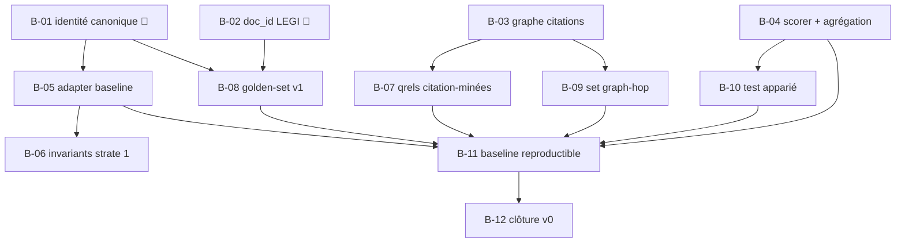

# BACKLOG — Version en cours : v0

> Work Plan du programme (`HANDBOOK.md` §2), régi par les règles de
> `PILOTAGE.md` §2 : **ordonné par les exigences de sortie de la
> version en cours** (`EXIGENCES_v0.md`), repriorisé à chaque revue
> bimensuelle. Un item qui ne sert aucune exigence sort du backlog
> (→ §4). WIP : **2 items 🔶 maximum** (`HANDBOOK.md` §3).
>
> État au 18 juillet 2026, amorcé depuis `STATUS.md`.

## 1. Backlog ordonné

| # | Item | Exigence(s) servie(s) | Projet | Statut |
|---|---|---|---|---|
| B-01 | Vérifier l'identité canonique croisée sur les 3 BDD (script + rapport) | E-P1-02 | P1 | 🔶 |
| B-02 | Vérifier la stabilité du `doc_id` article LEGI (test de ré-ingestion) | E-P1-03 | P1 | 🔶 |
| B-03 | Modéliser complètement le graphe de citations Neo4j (relations typées) | E-P1-04 | P1 | ⬜ |
| B-04 | Implémenter le scorer nDCG@R + diagnostics + règle d'agrégation chunk→document | E-P2-02, E-P2-03 | P2 | ⬜ |
| B-05 | Implémenter l'adapter baseline (runs au format ADR-008) | E-P2-01, E-T-01 | P2 | ⬜ |
| B-06 | Implémenter la suite d'invariants structurels (strate 1) | E-P2-04 | P2 | ⬜ |
| B-07 | Générer les qrels citation-minées (strate 2) depuis le graphe | E-P2-05 | P2 | ⬜ |
| B-08 | Produire le golden-set v1 synthétique + guide d'annotation + stratification 4 types d'action | E-P2-06, E-P2-07 | P2 | ⬜ |
| B-09 | Construire ≥ 1 set diagnostique graph-hop | E-P2-08 | P2 | ⬜ |
| B-10 | Implémenter le test statistique apparié | E-P2-09 | P2 | ⬜ |
| B-11 | Produire la baseline chiffrée reproductible (double run, artefacts versionnés) | E-P2-10, E-T-02 | P2 | ⬜ |
| B-12 | Mini-ADR de clôture v0 (constat sur preuves) | §5 `EXIGENCES_v0.md` | — | ⬜ |

## 2. Notes d'ordonnancement

- B-01 et B-02 sont les deux 🔶 courants (hérités de `STATUS.md`) :
  ils se terminent avant tout nouveau tirage.
- B-04 (scorer) est tirable en parallèle des travaux data : aucune
  dépendance aux bases, testable contre des valeurs de référence.
- B-08 (golden-set) suppose B-01 : pas de gel d'un golden-set sur des
  identités non vérifiées.

## 3. Plan par dépendances

Pas de Gantt (ADR-012) : l'ordonnancement est le graphe ci-dessous.
Un item est tirable quand tous ses prédécesseurs sont ✅.

Chemin critique probable : **B-01 → B-08 → B-11 → B-12** (le
golden-set et la baseline concentrent les dépendances).

## 4. Idées non engageantes (hors backlog)

Liste sans engagement ni ordre — rien ici ne sert une exigence v0.
Réexaminée au changement de version, jamais pendant.

- Câblage Neo4j dans le pipeline RAG de P3 (réveil : alpha ph.1)
- Composant de jugement inline (alpha ph.1 — ADR-010)
- Exposition externe de métriques IR agrégées vs signal binaire
  (question ouverte, chantier 8)
- Outillage de backlog dédié si le volume l'exige (révision du
  handbook à l'alpha)
