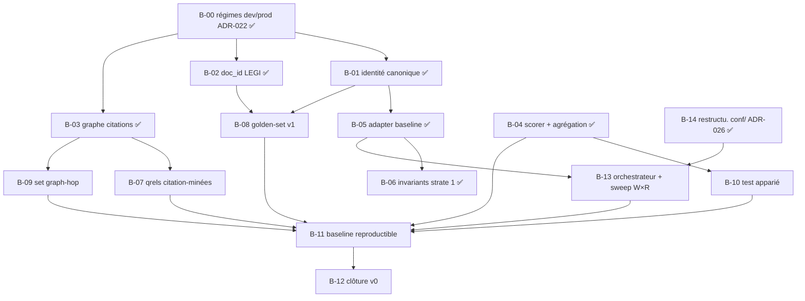

# BACKLOG — Version en cours : v0

> Work Plan du programme (`HANDBOOK.md` §2), régi par les règles de
> `PILOTAGE.md` §2 : **ordonné par les exigences de sortie de la
> version en cours** (`EXIGENCES_v0.md`), repriorisé à chaque revue
> bimensuelle. Un item qui ne sert aucune exigence sort du backlog
> (→ §4). WIP : **2 items 🔶 maximum** (`HANDBOOK.md` §3).
>
> État au 18 juillet 2026 (clôture B-00), amorcé depuis `STATUS.md`.

## 1. Backlog ordonné

| # | Item | Exigence(s) servie(s) | Projet | Statut |
|---|---|---|---|---|
| B-00 | Implémenter les régimes d'ingestion dev/prod (ADR-022, amendé ADR-023/024) : hydratation Neo4j, fin des unknowns, aplatissement par chemin complet, épuration Mongo + bump `SCHEMA_VERSION`, interrupteur d'embedding en dev (ADR-023, remplace les toggles par store), audit en conf. Échantillonnage corpus retiré (ADR-024 : sans objet ; corpus témoin → B-02) | E-P1-02, E-P1-03, E-P1-04 (prérequis) | P1 | ✅ |
| B-01 | Vérifier l'identité canonique croisée sur les 3 BDD | E-P1-02 | P1 | ✅ |
| B-02 | Vérifier la stabilité du `doc_id` article LEGI (test de ré-ingestion) | E-P1-03 | P1 | ✅ |
| B-03 | Modéliser complètement le graphe de citations Neo4j (relations typées) | E-P1-04 | P1 | ✅ |
| B-04 | Implémenter le scorer nDCG@R + diagnostics + règle d'agrégation chunk→document | E-P2-02, E-P2-03 | P2 | ✅ |
| B-05 | Implémenter l'adapter baseline (runs au format ADR-008) | E-P2-01, E-T-01 | P2 | ✅ |
| B-06 | Implémenter la suite d'invariants structurels (strate 1) | E-P2-04 | P2 | ✅ |
| B-07 | Générer les qrels citation-minées (strate 2) depuis le graphe | E-P2-05 | P2 | ⬜ |
| B-08 | Produire le golden-set v1 synthétique + guide d'annotation + stratification 4 types d'action | E-P2-06, E-P2-07 | P2 | ⬜ |
| B-09 | Construire ≥ 1 set diagnostique graph-hop | E-P2-08 | P2 | ⬜ |
| B-10 | Implémenter le test statistique apparié | E-P2-09 | P2 | ⬜ |
| B-11 | Produire la baseline chiffrée reproductible (double run **(W, R)**, artefacts versionnés) | E-P2-10, E-T-02 | P2 | ⬜ |
| B-12 | Mini-ADR de clôture v0 (constat sur preuves) | §5 `EXIGENCES_v0.md` | — | ⬜ |
| B-13 | Orchestrateur d'ingestion + sweep `W×R` (sous-processus `kedro run --params W`, séquentiel, `nuke` entre `W`, reprise sur incident) — plateforme end-to-end (ADR-027) | E-P2-10 (étendue) | P2 | ⬜ |
| B-14 | Restructurer `conf/` en partition `workflow / ingestion / evaluation` (ADR-026), fingerprint inchangé (test de non-régression) | E-P2-10 (prérequis couplage) | P1 | ✅ |

## 2. Notes d'ordonnancement

- **B-00 est ✅** : prouvé par deux runs `kedro run` réels (7/7 nœuds,
  statut `ok`, équation de complétude exacte 1121 = 1121 = 1121), bases
  vérifiées champ par champ (Mongo épuré `SCHEMA_VERSION` 2, Neo4j
  hydraté, Qdrant vecteurs non nuls).
- **B-01, B-02 et B-03 sont ✅** (revue du 19 juillet 2026) : identité
  canonique croisée vérifiée sur les 3 BDD, `doc_id` LEGI stable
  confirmé par test de ré-ingestion, graphe de citations Neo4j modélisé
  complètement (chaîne datée `succeeded_by` posée dès B-00, puis autres
  verbes de citation typés et cibles absentes résolues). Constat porté
  par le porteur du programme ; **aucun rapport/artefact versionné
  encore référencé** pour E-P1-02/03/04 malgré la vérification exigée
  par `EXIGENCES_v0.md` — à régulariser avant la clôture v0 (B-12) si
  jugé nécessaire.
- **B-04 est ✅** : scorer nDCG@R (coupe adaptative maison, gain injectable —
  exponentiel par défaut, linéaire en diagnostic) + agrégation chunk→document
  (ADR-006, max qrels / rang du 1er chunk runs) + diagnostics (R-Precision,
  Recall@2R, Doc-Recall@R maison ; MAP, Doc-MRR via `ranx`, ADR-027).
  **Localisation révisée** : nouveau projet dédié `eval/` (dossier in-repo
  pour l'instant, extraction en submodule différée), et non un sous-paquet de
  `data/` comme prévu à la revue du 19 juillet 2026 — fidèle à ADR-027 (P2
  pilote l'ingestion par sous-processus, sans importer `ragcore`). Oracle
  primaire *auto pur* (ADR-028) : cas jouets calculés à la main
  (`tests/golden/`), cross-check `trec_eval`/`pytrec_eval` secondaire et hors
  CI par défaut (`tests/oracle/`). Suite verte (54 tests), mypy strict et
  ruff propres. Constat empirique notable : `pytrec_eval`'s `ndcg_cut` est en
  gain linéaire, pas exponentiel — documenté dans le code du cross-check.
- **B-05 est ✅** : adapter baseline (config dense de référence) dans `eval/`,
  contrat ADR-016 `requête → IDs ordonnés`. Chemin de lecture Qdrant/TEI/Mongo
  **dédié, sans import de `ragcore`** (ADR-027). Constat clé de l'exploration :
  le `doc_id` canonique est **gratuit** — l'ingestion l'écrit dans le payload
  Qdrant (clé `identifier`, ADR-018), donc une recherche `with_payload` le
  remonte sans aucun aller-retour Mongo ; il est copié tel quel dans
  `RunEntry.doc_id`. Nom de collection lu du pointeur `MURPHY_META`
  (comme le backend). Writer JSONL immuable `dump_jsonl_run` (round-trip vérifié
  avec le loader existant). Ports `Retriever`/`Embedder`/`Searcher` (couture
  B-13). Suite : 75 tests unit/golden verts + 1 test `integration`
  (testcontainers Qdrant, hors CI), mypy strict et ruff propres. **B-06 et B-13
  deviennent tirables** côté prérequis B-05.
- **B-06 est ✅** : suite d'invariants structurels de strate 1 (ADR-017),
  part **pure** — `eval/src/murphy_eval/core/services/invariants.py`, aucune
  base de données. Collecte les `Violation` d'un run/qrels (rangs contigus +
  uniques, pas de doublon `(query_id, chunk_id)`, ids non vides, espaces de
  nommage `doc_id` run↔qrels compatibles) et les branche en option sur les
  loaders JSONL (`validate=True` → `InvariantError`). Suite `unit` verte en
  CI (94 tests), mypy strict et ruff propres — satisfait E-P2-04. **Décision
  de périmètre** : complétude et intégrité des liens Neo4j (strate 1 *live*,
  sur BDD peuplées) restent hors v0, déjà couvertes côté `data/` (B-00/B-01/
  B-03) ; les re-faire ici serait un doublon. Ce que B-06 régularise : la
  preuve mécanique versionnée que les artefacts sont structurellement sains.
- B-08 (golden-set) est désormais tirable : B-01 et B-02 sont acquis.
- **B-14 est ✅** : `conf/` restructuré en `base/{workflow,ingestion,evaluation}/`
  (sous-dossiers de `base/`, seul env lu par défaut par Kedro — écart
  assumé à la lettre d'ADR-026, documenté dans l'ADR). Fingerprint
  vérifié **identique** avant/après (`9424808d1c636d533648bbf4e77f2496`)
  par `golden/test_fingerprint.py`, désormais chargé via le vrai
  `OmegaConfigLoader`. B-13 (P2) devient tirable côté prérequis P1.
- **B-13 dépend de B-05** (l'adapter doit savoir consommer une
  collection avant qu'on orchestre la production de collections). Il
  étend E-P2-10 : la reproductibilité inclut désormais le chemin
  d'ingestion `W`, pas seulement le runtime `R`.

## 3. Plan par dépendances

Pas de Gantt (ADR-012) : l'ordonnancement est le graphe ci-dessous.
Un item est tirable quand tous ses prédécesseurs sont ✅.

Chemin critique probable : **B-00 → B-01 → B-08 → B-13 → B-11 → B-12**
(le golden-set et la baseline concentrent les dépendances ; B-13 y
insère l'orchestrateur end-to-end, lui-même précédé de B-14 côté P1).

## 4. Idées non engageantes (hors backlog)

Liste sans engagement ni ordre — rien ici ne sert une exigence v0.
Réexaminée au changement de version, jamais pendant.

- Câblage Neo4j dans le pipeline RAG de P3 (réveil : alpha ph.1)
- Composant de jugement inline (alpha ph.1 — ADR-010)
- Exposition externe de métriques IR agrégées vs signal binaire
  (question ouverte, chantier 8)
- Outillage de backlog dédié si le volume l'exige (révision du
  handbook à l'alpha)
