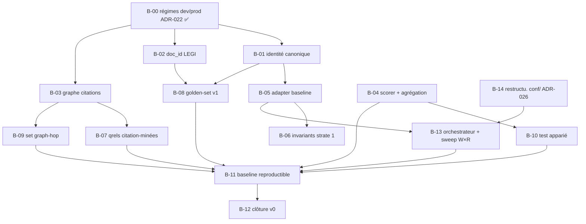

# BACKLOG — Version en cours : v0

> Work Plan du programme (`HANDBOOK.md` §2), régi par les règles de
> `PILOTAGE.md` §2 : **ordonné par les exigences de sortie de la
> version en cours** (`EXIGENCES_v0.md`), repriorisé à chaque revue
> bimensuelle. Un item qui ne sert aucune exigence sort du backlog
> (→ §4). WIP : **2 items 🔶 maximum** (`HANDBOOK.md` §3).
>
> État au 18 juillet 2026 (clôture B-00), amorcé depuis `STATUS.md`.

## 1. Backlog ordonné

| # | Item | Exigence(s) servie(s) | Projet | Statut |
|---|---|---|---|---|
| B-00 | Implémenter les régimes d'ingestion dev/prod (ADR-022, amendé ADR-023/024) : hydratation Neo4j, fin des unknowns, aplatissement par chemin complet, épuration Mongo + bump `SCHEMA_VERSION`, interrupteur d'embedding en dev (ADR-023, remplace les toggles par store), audit en conf. Échantillonnage corpus retiré (ADR-024 : sans objet ; corpus témoin → B-02) | E-P1-02, E-P1-03, E-P1-04 (prérequis) | P1 | ✅ |
| B-01 | Vérifier l'identité canonique croisée sur les 3 BDD | E-P1-02 | P1 | ✅ |
| B-02 | Vérifier la stabilité du `doc_id` article LEGI (test de ré-ingestion) | E-P1-03 | P1 | ✅ |
| B-03 | Modéliser complètement le graphe de citations Neo4j (relations typées) | E-P1-04 | P1 | ✅ |
| B-04 | Implémenter le scorer nDCG@R + diagnostics + règle d'agrégation chunk→document | E-P2-02, E-P2-03 | P2 | ⬜ |
| B-05 | Implémenter l'adapter baseline (runs au format ADR-008) | E-P2-01, E-T-01 | P2 | ⬜ |
| B-06 | Implémenter la suite d'invariants structurels (strate 1) | E-P2-04 | P2 | ⬜ |
| B-07 | Générer les qrels citation-minées (strate 2) depuis le graphe | E-P2-05 | P2 | ⬜ |
| B-08 | Produire le golden-set v1 synthétique + guide d'annotation + stratification 4 types d'action | E-P2-06, E-P2-07 | P2 | ⬜ |
| B-09 | Construire ≥ 1 set diagnostique graph-hop | E-P2-08 | P2 | ⬜ |
| B-10 | Implémenter le test statistique apparié | E-P2-09 | P2 | ⬜ |
| B-11 | Produire la baseline chiffrée reproductible (double run **(W, R)**, artefacts versionnés) | E-P2-10, E-T-02 | P2 | ⬜ |
| B-12 | Mini-ADR de clôture v0 (constat sur preuves) | §5 `EXIGENCES_v0.md` | — | ⬜ |
| B-13 | Orchestrateur d'ingestion + sweep `W×R` (sous-processus `kedro run --params W`, séquentiel, `nuke` entre `W`, reprise sur incident) — plateforme end-to-end (ADR-027) | E-P2-10 (étendue) | P2 | ⬜ |
| B-14 | Restructurer `conf/` en partition `workflow / ingestion / evaluation` (ADR-026), fingerprint inchangé (test de non-régression) | E-P2-10 (prérequis couplage) | P1 | ⬜ |

## 2. Notes d'ordonnancement

- **B-00 est ✅** : prouvé par deux runs `kedro run` réels (7/7 nœuds,
  statut `ok`, équation de complétude exacte 1121 = 1121 = 1121), bases
  vérifiées champ par champ (Mongo épuré `SCHEMA_VERSION` 2, Neo4j
  hydraté, Qdrant vecteurs non nuls). B-01, B-02 et B-03 sont désormais
  **tirables** (le verrou « état des BDD non vérifiable avant ADR-022 »
  est levé). WIP libre : aucun 🔶 courant.
- Un correctif de revue de B-00 a **modélisé l'axe temporel** :
  l'ancien produit cartésien `has_version` (2 760 arêtes « dans tous
  les sens ») est devenu la chaîne datée `succeeded_by` (288 arêtes,
  linéarité stricte, mort-nées en branche latérale). C'est une brique
  de B-03, faite en avance parce que le régime dev/prod exigeait un
  graphe correct ; **B-03 reste ouvert** (les autres verbes de
  citation, leur typage complet, la résolution des cibles absentes).
- B-04 (scorer) est tirable en parallèle des travaux data : aucune
  dépendance aux bases, testable contre des valeurs de référence.
- B-08 (golden-set) suppose B-01 : pas de gel d'un golden-set sur des
  identités non vérifiées.
- **B-14 (P1) est prérequis de B-13 (P2)** : le couplage
  config↔fingerprint (ADR-027) suppose la partition `workflow/`
  explicite (ADR-026). B-14 touche l'ingestion, se fait dans `data/`,
  avec test de non-régression du fingerprint (une même config doit
  produire la même empreinte avant/après).
- **B-13 dépend de B-05** (l'adapter doit savoir consommer une
  collection avant qu'on orchestre la production de collections). Il
  étend E-P2-10 : la reproductibilité inclut désormais le chemin
  d'ingestion `W`, pas seulement le runtime `R`.

## 3. Plan par dépendances

Pas de Gantt (ADR-012) : l'ordonnancement est le graphe ci-dessous.
Un item est tirable quand tous ses prédécesseurs sont ✅.

Chemin critique probable : **B-00 → B-01 → B-08 → B-13 → B-11 → B-12**
(le golden-set et la baseline concentrent les dépendances ; B-13 y
insère l'orchestrateur end-to-end, lui-même précédé de B-14 côté P1).

## 4. Idées non engageantes (hors backlog)

Liste sans engagement ni ordre — rien ici ne sert une exigence v0.
Réexaminée au changement de version, jamais pendant.

- Câblage Neo4j dans le pipeline RAG de P3 (réveil : alpha ph.1)
- Composant de jugement inline (alpha ph.1 — ADR-010)
- Exposition externe de métriques IR agrégées vs signal binaire
  (question ouverte, chantier 8)
- Outillage de backlog dédié si le volume l'exige (révision du
  handbook à l'alpha)
