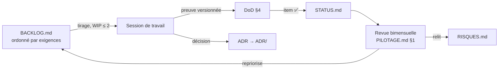

# HANDBOOK — Méthode de travail du programme (chantier 6, extension)

> Project Handbook au sens PM², **taillé pour un programme solo**
> (tailoring consigné par ADR-021). Ce document explicite *comment* le
> travail est produit ; il ne décide ni du *quoi* (`VERSIONS.md`,
> `EXIGENCES_v0.md`) ni du *pourquoi* (`VISION.md`). Audience : le
> porteur du programme. Complète `PILOTAGE.md` (rituel de suivi) sans
> le remplacer.

## 1. Positionnement méthodologique

Le programme suit **PM² comme cadre de gouvernance documentaire** et
les **méthodes agiles comme mode d'exécution** :

- PM² fournit la liste des artefacts de pilotage et leur rôle. Chaque
  artefact est soit porté par un document existant (§2), soit
  explicitement écarté avec motif (§2). Aucun artefact « parce que le
  framework le demande ».
- L'exécution est en **flux tiré (kanban)**, pas en sprints : le
  travail solo à cadence variable rend les engagements d'itération
  artificiels. La cadence est donnée par la **revue bimensuelle**
  (`PILOTAGE.md` §1), qui joue le rôle des cérémonies agiles
  (revue + rétrospective + replanification, condensées).
- Aucune planification datée en interne (ADR-012) : la progression se
  mesure en **critères de sortie vérifiés**, l'ordonnancement en
  **dépendances** (`BACKLOG.md` §3).

## 2. Tailoring PM² — correspondance des artefacts

| Artefact PM² | Porté par | Statut |
|---|---|---|
| Project Charter | `VISION.md` + `PROGRAM.md` | ✅ |
| Business Case | `INSTITUTIONNEL.md` (chantier 8) | 🟡 |
| Project Handbook | présent document | ✅ |
| Project Work Plan | `BACKLOG.md` (items + dépendances) | ✅ |
| Requirements / spécifications | `EXIGENCES_v0.md` (une par version) | ✅ |
| Decision Log | registre `ADR/` (ADRs Nygard) | ✅ |
| Risk Log | `RISQUES.md` | ✅ |
| Issue Log | fusionné dans `BACKLOG.md` (un problème = un item) | écarté comme doc séparé |
| Change Log | non tenu — tout changement notable passe par ADR | écarté |
| Status Report | `STATUS.md` + log de revue (`PILOTAGE_log.md`) | ✅ |
| Milestones / planning | `VERSIONS.md` (capacités, pas de dates — ADR-012) | ✅ |
| Stakeholder Matrix | différé au chantier 8 (seul chantier à audience externe) | ⬜ |
| Quality Plan | DoD (§4) + harnais P2 (la qualité *est* mesurée par l'évaluation) | ✅ |

**Règle de complétude** : si un besoin de pilotage apparaît qui n'est
couvert par aucune ligne de ce tableau, le tableau est révisé par ADR
— on ne crée pas de document orphelin.

## 3. Exécution en flux (kanban solo)

- **Colonnes** : ⬜ à faire · 🔶 en cours · ✅ fait — les conventions
  de statut existantes servent d'états kanban, aucun outil dédié.
- **Limite de travail en cours : 2 items 🔶 maximum**, tous projets
  confondus. Un troisième chantier ouvert = signal de dispersion ;
  on termine ou on rebascule en ⬜ explicitement.
- **Tirage** : à chaque session de travail, on tire l'item ⬜ le plus
  haut du `BACKLOG.md` dont les dépendances sont ✅. Pas de
  cherry-picking d'items « agréables » plus bas dans la pile.
- **User stories** : réservées à l'alpha ph.1, quand des utilisateurs
  réels (experts juridiques) existent. En v0, les items sont des
  **exigences testables** (`EXIGENCES_v0.md`) — il n'y a pas
  d'utilisateur à raconter.

## 4. Definition of Done

Un item du backlog est ✅ si et seulement si :

1. l'**exigence servie** (`EXIGENCES_v0.md`) est vérifiée par le moyen
   de vérification qu'elle déclare (test, run, artefact) ;
2. la **preuve est versionnée** (commit, run archivé, fichier de
   sortie) — cohérent avec `PILOTAGE.md` §3 : le changement de version
   est un constat sur preuves ;
3. toute **décision prise en cours de route** est consignée en ADR ;
4. `STATUS.md` est mis à jour.

Pas de « fait à 90 % » : un item non terminé reste 🔶.

## 5. Mesures de pilotage internes (v0)

Deux mesures, relevées à chaque revue bimensuelle, en tête du log :

1. **Avancement version** : critères de sortie v0 vérifiés / total
   (source : `EXIGENCES_v0.md`).
2. **Débit** : items du backlog passés ✅ depuis la dernière revue.

Rien d'autre. Les KPIs à quatre niveaux (livrable 2 du chantier 8)
sont un cadre à audience externe, sans recouvrement avec ces deux
mesures internes. Les métriques IR (`RBP(p)` + résidu, `Recall@R`) mesurent le
*système*, pas le *programme* — elles restent dans P2.

**Invariant transverse sur les métriques** (reformulé par ADR-025) :

> Par défaut, aucune donnée comportementale n'est collectée. Toute
> collecte comportementale vit dans l'environnement panel, sous opt-in
> explicite, à finalité d'évaluation documentée et publiée.

Les signaux comportementaux (CTR, dwell time, interleaving…)
n'existent donc que côté panel (beta — ADR-025), en comparaisons
relatives uniquement ; aucun chiffre absolu du panel n'est exposé.

## 6. Cycle de travail

## 7. Révision du présent document

Ce handbook change par ADR (hygiène documentaire, `PILOTAGE.md` §4).
Il sera révisé au plus tard à l'entrée en alpha ph.1 : introduction
des user stories, des experts dans la boucle, et d'un éventuel
outillage de backlog si le volume l'exige.
