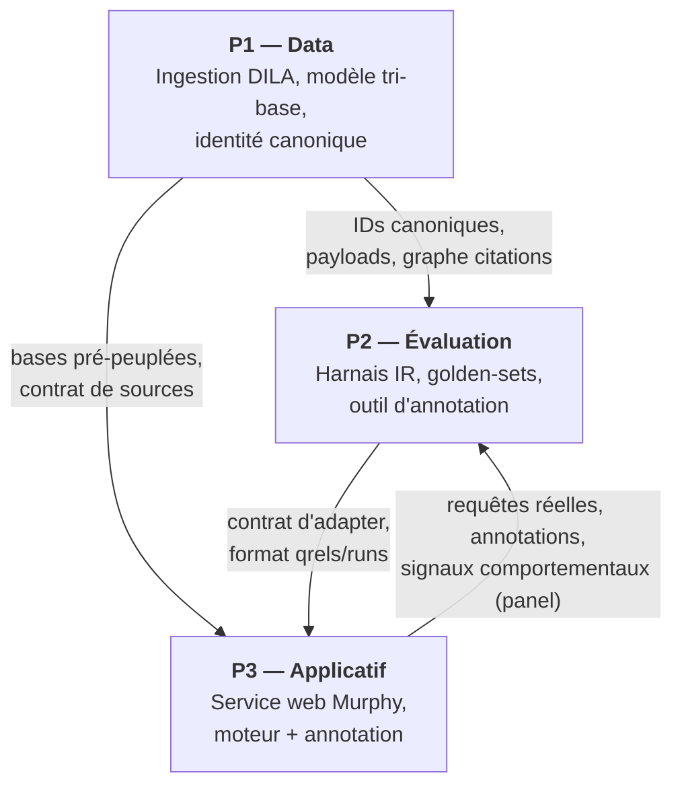
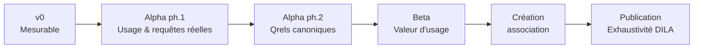

# PROGRAM — Cadrage du programme Murphy

> Document de référence du programme. Remplace `ROADMAP.md` (archivé).
> Matérialise les arbitrages structurants : découpage en projets et
> interfaces. Les versions vivent dans `VERSIONS.md`, les décisions dans
> `ADR/`, le rituel de suivi dans `PILOTAGE.md`.
>
> **Convention de lecture** : ✅ = tranché (ADR référencé) ·
> 🔶 = proposition à valider · ⬜ = ouvert. Aucune date : les versions
> sont définies par des **capacités mesurables** (ADR-012).

---

## 1. Objet

Murphy n'est pas un projet mais un **programme** : trois projets
interdépendants, convergeant vers une **alpha avec des experts en droit**
dans la boucle. Ce document fixe le « quoi » ;
le « quand (conditionnel) » vit dans `VERSIONS.md` ; le « comment » vit
dans les documents de chaque projet.

---

## 2. Structure du programme

### 2.1 Les projets

| Projet | Rôle | Statut actuel |
|--------|------|---------------|
| **P1 — Data** | Ingestion de chaque base DILA, modèle de données tri-base (MongoDB / Neo4j / Qdrant — ADR-020), identité canonique stable inter-BDD (ADR-018) | Actif — LEGI fait, 5 bases jurisprudence ingérées (ADR-002) |
| **P2 — Évaluation** | Harnais IR agnostique (récupération seule — ADR-016), golden-sets stratifiés (ADR-017), outil d'annotation | Cadré (`CADRAGE_evaluation` + ADR-004 à 009), non implémenté |
| **P3 — Applicatif** | Service web : moteur de recherche sourcé + modes annotation (ADR-010) ; déployé en beta dans deux environnements public/panel d'un même artefact (ADR-025) | MVP RAG existant, en pause, à réveiller pour l'alpha |

> **Double nature de P2** : c'est à la fois un **outil interne** (mesurer
> P1 + P3) et le **cœur de la boucle experts** de l'alpha. Le futur outil
> d'annotation n'est donc pas un détail de P2 mais un **livrable
> produit** de P3 pendant l'alpha (ADR-013).

### 2.2 Interfaces (contrats inter-projets)

| De → Vers | Contrat |
|-----------|---------|
| P1 → P2 | `chunk_id` / `doc_id` canoniques et déterministes ; payloads Qdrant ; contenu MongoDB ; **graphe de citations Neo4j** (source des qrels citation-minées) |
| P1 → P3 | Bases pré-peuplées ; contrat de source (`chunkId`, `title`, `type`, `score`, + `excerpt`, `eli` requis alpha) |
| P2 → P3 | Contrat d'adapter unique : `requête → liste ordonnée d'IDs (+ scores)` (ADR-016) ; formats `qrels` / `runs` (ADR-008) |
| P3 → P2 | Requêtes réelles + annotations produites par les experts (boucle alpha, ADR-010) ; à partir de la beta, signaux comportementaux de l'environnement panel — opt-in, comparaisons relatives uniquement (ADR-025) |

> **Invariant bloquant** (ADR-018) : un même chunk/document porte le
> **même ID** dans Qdrant, Neo4j et MongoDB. Sans cette couche d'identité
> canonique, ni l'évaluation agnostique ni la boucle experts ne sont
> possibles.

---

## 3. Versions → `VERSIONS.md`

Progression : **v0 → alpha (2 phases) → beta → association →
publication**. Chaque version est définie par un objectif, un périmètre
in/out et des **critères d'entrée/sortie mesurables** — détail complet
dans `VERSIONS.md`. Le jalon « Création association » (ADR-015) est
détaillé dans `INSTITUTIONNEL.md`, dont les exigences (conformité, KPIs
d'impact) sont des critères d'entrée beta/publication. Restent à statut
non final : la **beta** (🔶, à réécrire après l'alpha) et le contenu de
la **vague 2** d'ingestion (différé — ADR-003).

---

## 4. Séquençage d'ingestion DILA ✅ (ADR-003)

Ingestion **progressive**, priorisée par valeur pour les experts.
L'exhaustivité DILA est un critère de **publication** (ADR-014).

| Vague | Bases | Version cible |
|-------|-------|---------------|
| Faite | LEGI | — |
| 1 (fait) | CASS, INCA, CAPP, JADE, CONSTIT (ADR-002) | v0 |
| 2 | JORF + base(s) à déterminer sur retours alpha (candidates : KALI, CIRCULAIRES) | beta |
| 3 | Solde DILA (DOLE, CNIL, débats/QR parlementaires, SARDE, protocoles…) | publication |

Le choix différé du contenu de la vague 2 est assumé ; il sera clos par
un mini-ADR à l'issue de l'alpha.

---

## 5. Stratégie d'évaluation en strates ✅ (ADR-017)

L'évaluation est pensée en **strates de pérennité**, pour qu'une
amélioration du pipeline soit mesurable sans dépendre entièrement
d'annotations jetables. Détail dans `CADRAGE_evaluation`.

| Strate | Nature | Annotation | Pérennité |
|--------|--------|-----------|-----------|
| **1. Invariants structurels** | Qualité de données : identité canonique, complétude, déterminisme, intégrité des liens | Aucune | Totale |
| **2. Qrels citation-minées** | Vérité terrain objective : les citations réelles (magistrats) définissent des pertinences vérifiables | Aucune (garde-fou circularité §3.3) | Permanente |
| **3. Métriques appariées relatives** | Divergence entre configs (RBO / Jaccard@k, stabilité sous paraphrase) — détecte régressions, cible le pooling | Aucune | Par construction |
| **4. Qrels humaines** | Synthétiques solo (v0) → expertes poolées (alpha) | Forte | Partielle : le synthétique est **relégué** (`origin: synthetic`), pas jeté |
| **5. Signaux online panel** (beta — ADR-025) | Comportemental : CTR, dwell time, abandon, reformulation, interleaving — environnement panel opt-in uniquement | Aucune (télémétrie consentie) | Liée au panel ; **comparaisons relatives uniquement** |

**Conséquence** : la baseline v0 s'appuie sur les strates 1–3 +
citations minées + un petit set synthétique. Seule la dernière tranche
est dévaluée par l'alpha ; l'infrastructure et l'essentiel des signaux
survivent.

---

## 6. Décisions

Les décisions ouvertes bloquantes du cadrage ont toutes été tranchées le
17 juillet 2026 (chantier 4) et sont consignées dans le registre
**`ADR/`** : ADR-001 à 010 (arbitrages), ADR-011 à 020
(rétro-documentation des décisions implicites), puis ADR-021 à 025 au
fil de l'exécution. La décision ouverte « architecture deux modes de
P3 » est close par **ADR-025** (environnements public/panel d'un même
artefact). Voir `ADR/INDEX.md`, y compris la liste des **points
ouverts rattachés** (clôture vague 2, `doc_id` article LEGI, ADR
institutionnels du chantier 8).
