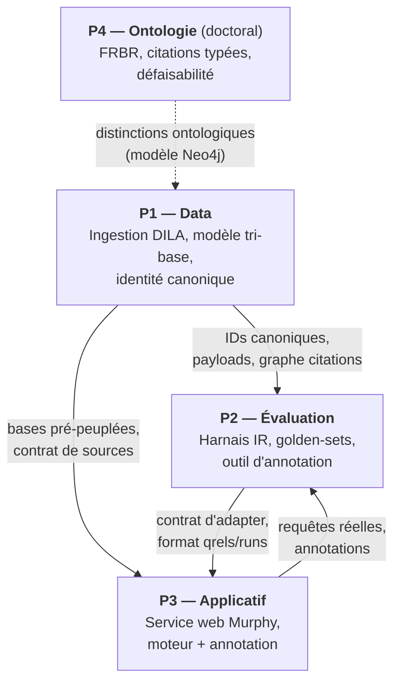
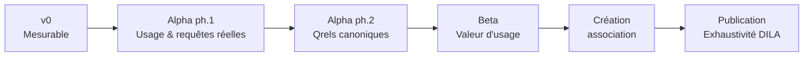

# PROGRAM — Cadrage du programme Murphy
 
> Document de référence du programme. Remplace `ROADMAP.md` (à archiver).
> Matérialise les arbitrages structurants : découpage en projets, interfaces,
> définition des versions, séquençage d'ingestion, stratégie d'évaluation.
>
> **Convention de lecture** : ✅ = tranché · 🔶 = proposition à valider ·
> ⬜ = ouvert (deviendra un ADR). Aucune date : les versions sont définies par
> des **capacités mesurables**, pas par un calendrier.
 
---
 
## 1. Objet
 
Murphy n'est pas un projet mais un **programme** : trois projets
interdépendants, plus un volet doctoral, convergeant vers une **alpha avec des
experts en droit** dans la boucle. Ce document fixe le « quoi » et le « quand
(conditionnel) » ; le « comment » vit dans les documents de chaque projet.
 
---
 
## 2. Structure du programme
 

 
### 2.1 Les projets
 
| Projet | Rôle | Statut actuel |
|--------|------|---------------|
| **P1 — Data** | Ingestion de chaque base DILA, modèle de données tri-base (MongoDB / Neo4j / Qdrant), identité canonique stable inter-BDD | Actif — LEGI fait, jurisprudence en cours |
| **P2 — Évaluation** | Harnais IR agnostique (récupération seule), golden-sets stratifiés, outil d'annotation | Cadré (`CADRAGE_evaluation`), non implémenté |
| **P3 — Applicatif** | Service web : moteur de recherche sourcé + mode annotation | MVP RAG existant, en pause, à réveiller pour l'alpha |
| **P4 — Ontologie** 🔶 | Méthodologie de construction d'ontologie juridique (travail doctoral) | Hors programme opérationnel, interfaces déclarées vers P1 — **à confirmer** |
 
> **Double nature de P2** : c'est à la fois un **outil interne** (mesurer
> P1 + P3) et le **cœur de la boucle experts** de l'alpha. Le futur outil
> d'annotation n'est donc pas un détail de P2 mais un **livrable produit** de
> P3 pendant l'alpha.
 
### 2.2 Interfaces (contrats inter-projets)
 
| De → Vers | Contrat |
|-----------|---------|
| P1 → P2 | `chunk_id` / `doc_id` canoniques et déterministes ; payloads Qdrant ; contenu MongoDB ; **graphe de citations Neo4j** (source des qrels citation-minées) |
| P1 → P3 | Bases pré-peuplées ; contrat de source (`chunkId`, `title`, `type`, `score`, + `excerpt`, `eli` requis alpha) |
| P2 → P3 | Contrat d'adapter unique : `requête → liste ordonnée d'IDs (+ scores)` ; formats `qrels` / `runs` (TREC-like) |
| P3 → P2 | Requêtes réelles + annotations produites par les experts (boucle alpha) |
| P4 → P1 🔶 | Distinctions ontologiques (FRBR Work/Expression/Manifestation, citations typées) informant le modèle de nœuds/arêtes Neo4j |
 
> **Invariant bloquant** (voir `CADRAGE_evaluation` §2) : un même chunk/document
> porte le **même ID** dans Qdrant, Neo4j et MongoDB. Sans cette couche
> d'identité canonique, ni l'évaluation agnostique ni la boucle experts ne sont
> possibles.
 
---
 
## 3. Définition des versions
 
Progression : **v0 → alpha (2 phases) → beta → association → publication**.
 

 
### v0 — « Mesurable » ✅
**Objectif** : disposer d'un socle data + un harnais d'évaluation permettant de
mesurer et comparer objectivement les configurations de récupération.
 
| | |
|--|--|
| **In** | LEGI (fait) + jurisprudence (voir §4) ingérées avec identité canonique **vérifiée sur les 3 BDD** ; harnais d'évaluation (strates 1–3 + qrels citation-minées + set synthétique solo, voir §5) ; baseline chiffrée et reproductible |
| **Out** | Applicatif web, experts, bases DILA non-jurisprudentielles, LLM générateur branché à l'évaluation |
| **Entrée** | Pipeline LEGI stable ; modèle de données tri-base arrêté |
| **Sortie** | DoD du `CADRAGE_evaluation` (étendu jurisprudence) : identité canonique vérifiée · adapter baseline implémenté · golden-set v1 figé et versionné · scorer nDCG@k / Recall@k / Doc-Recall@k / Doc-MRR · test statistique apparié · ≥1 set diagnostique graph-hop · baseline reproductible |
 
### Alpha phase 1 — « Usage & requêtes réelles » ✅ (option C.1)
**Objectif** : mettre Murphy entre les mains d'experts pour recueillir le besoin
et générer un pool de **requêtes réelles** + notations au fil de l'eau.
 
| | |
|--|--|
| **In** | Réveil de P3 (moteur : sources cliquables + excerpt + score) ; **mode annotation inline** (grades 0–3 sur les résultats) ; accès restreint ; déploiement ; authentification minimale |
| **Out** | Mode campagne poolée (ph.2), A/B, métriques beta complètes |
| **Entrée** | v0 atteinte (baseline mesurable) |
| **Sortie** | Pool de requêtes réelles constitué ; besoins experts formalisés ; notations inline collectées |
 
### Alpha phase 2 — « Qrels canoniques » ✅ (option C.2)
**Objectif** : produire le golden-set **canonique** via campagnes d'annotation
poolées sur les requêtes réelles de la ph.1.
 
| | |
|--|--|
| **In** | **Mode campagne** (file de paires requête↔passage issues du pooling, guide d'annotation affiché, calibration inter-experts, progression trackée) |
| **Out** | Beta (A/B, feedback produit) |
| **Entrée** | Pool de requêtes réelles disponible |
| **Sortie** | Golden-set v2 (expert, poolé, calibré) figé et versionné ; baseline **re-mesurée** sur qrels expertes |
 
### Beta — « Valeur d'usage » 🔶
**Objectif** : valider la valeur et l'UX auprès de vrais utilisateurs.
Reprend l'esprit de `BETA.md` (**gelé** — à réécrire à la lumière des retours
alpha) : A/B aveugle prompt/retrieval, feedback utile/pas utile, métriques sans
contenu, OAuth 2.0, streaming (déjà en place).
Périmètre données : extension progressive aux bases DILA restantes (voir §4).
 
### Création de l'association ✅ (jalon organisationnel)
Se situe **entre beta et publication**. Formalise la structure porteuse avant
l'ouverture publique. Déclenche les chantiers non techniques (statuts, IP,
modèle d'exploitation, conformité renforcée).
 
### Publication — « Exhaustivité DILA » ✅
**Exhaustivité DILA = critère de publication**, pas de v0. Toutes les bases DILA
ingérées ; robustesse et scaling ; conformité ; modèle d'exploitation durable.
 
---
 
## 4. Séquençage d'ingestion DILA
 
**Principe tranché** ✅ : ingestion **progressive**, priorisée par valeur pour
les experts. La jurisprudence et le droit positif consolidé d'abord ; les
travaux parlementaires et référentiels ensuite. L'exhaustivité est une exigence
de **publication**.
 
**Proposition de séquence** 🔶 (à valider — deviendra un ADR) :
 
| Vague | Bases | Version cible |
|-------|-------|---------------|
| Faite | LEGI | — |
| 1 | CASS, INCA, CAPP (judiciaire) · JADE (administratif) · CONSTIT | v0 |
| 2 | JORF, KALI | beta |
| 3 | DOLE, CIRCULAIRES, CNIL, débats/QR parlementaires, SARDE, protocoles | publication |
 
> ⬜ **À trancher** : le périmètre jurisprudentiel **exact** requis pour clôturer
> la v0 (les 5 bases, ou un sous-ensemble couvrant les deux ordres — p. ex.
> CASS + JADE — suffisant pour prouver la réplicabilité de la méthode).
 
> **Note de cohérence** : `Overview_des_datasets.md` et `BETA.md` indiquent la
> jurisprudence « hors scope beta ». Cette position est **caduque** — la
> jurisprudence entre dès la v0. Ces documents seront corrigés lors du
> nettoyage (chantier 7).
 
---
 
## 5. Stratégie d'évaluation en strates (résolution T2)
 
L'évaluation est pensée en **strates de pérennité**, pour qu'une amélioration du
pipeline soit mesurable sans dépendre entièrement d'annotations jetables. Détail
dans `CADRAGE_evaluation`.
 
| Strate | Nature | Annotation | Pérennité |
|--------|--------|-----------|-----------|
| **1. Invariants structurels** | Qualité de données : identité canonique, complétude, déterminisme, intégrité des liens | Aucune | Totale |
| **2. Qrels citation-minées** | Vérité terrain objective : les citations réelles (magistrats) définissent des pertinences vérifiables | Aucune (garde-fou circularité §3.3) | Permanente |
| **3. Métriques appariées relatives** | Divergence entre configs (RBO / Jaccard@k, stabilité sous paraphrase) — détecte régressions, cible le pooling | Aucune | Par construction |
| **4. Qrels humaines** | Synthétiques solo (v0) → expertes poolées (alpha) | Forte | Partielle : le synthétique est **relégué** (`origin: synthetic`), pas jeté |
 
**Conséquence** : la baseline v0 s'appuie sur les strates 1–3 + citation-minées
+ un petit set synthétique. Seule la dernière tranche est dévaluée par l'alpha ;
l'infrastructure et l'essentiel des signaux survivent.
---
 
## 6. Décisions ouvertes bloquantes
 
À trancher avant/pendant l'implémentation ; chacune deviendra un ADR
(`decisions/`).
 
- ⬜ **Statut de P4** (ontologie) : hors programme avec interfaces déclarées, ou
  intégré.
- ⬜ **Périmètre jurisprudentiel exact de la v0** (§4).
- ⬜ **Séquençage DILA** définitif (§4).
- ⬜ Décisions du §9 de `CADRAGE_evaluation` : définition de l'unité
  « document » · échelle de pertinence + guide d'annotation · règle
  d'agrégation chunk→document · valeurs de k · formats qrels/runs.
- ⬜ **Architecture des deux modes de P3** : facteurs communs (affichage de
  passages) vs spécifique (annotation inline vs campagne poolée).
---
 
## 7. Décisions déjà actées (extrait)
 
À consolider dans `decisions/` (chantier 5) :
 
- ✅ Périmètre : cadrage de **l'écosystème complet** (programme à 3 projets + P4).
- ✅ Versions définies par **capacités mesurables**, sans dates.
- ✅ v0 = « mesurable » (data + éval), **sans** applicatif ni exhaustivité DILA.
- ✅ Alpha en **deux phases** (option C : usage/requêtes réelles, puis qrels
  poolées).
- ✅ Exhaustivité DILA = critère de **publication**.
- ✅ Évaluation en **strates de pérennité** (T2).
- ✅ Association créée **entre beta et publication**.
- ✅ Pilotage : **revue bimensuelle** en solo.
- ✅ (Hérités) ECLI identifiant primaire · rejet d'Akoma Ntoso · stateless ·
  fail-fast · pertinence graduée · découplage récupération/génération.