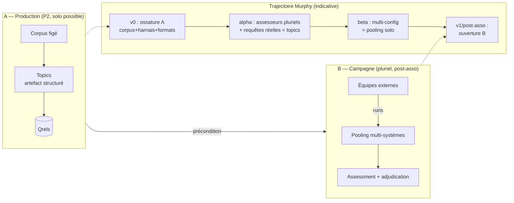

# TREC & le Legal Track comme référence méthodologique

> **Nature.** Dossier de recherche — revue menée le 2 août 2026 pour instruire le
> paradigme d'évaluation du programme. Comme les autres dossiers de ce répertoire, il
> est **daté et non maintenu** : il ne se met pas à jour, il se remplace.
>
> **Ce qu'il a produit** : **[ADR-035](../ADR/ADR-035-paradigme-evaluation-trec-legal-track.md)**,
> qui aligne le paradigme d'évaluation sur le Legal Track — deux machines ordonnées,
> présomption symétrique, appareil de réception avant / machinerie après panne, vérité
> achetée par assesseur, critère « rien à jeter ». Ce dossier **ne décide rien** ; il
> rassemble le matériau sur lequel cet ADR s'appuie.
>
> **Principe de finesse.** Le retour d'expérience TREC enseigne de *démarrer
> délibérément sous-outillé et de ne promouvoir un mécanisme qu'après panne observée* —
> c'est ADR-012 appliqué au processus d'évaluation. ⚠️ **Cette leçon ne vaut que pour la
> machinerie d'évaluation, pas pour l'appareil de réception** : l'infrastructure du Legal
> Track (corpus figé, formats, outil d'évaluation) existait dès l'année 1. La distinction
> est tranchée en ADR-035 §4 ; elle n'était pas faite dans la rédaction initiale de cette
> note.
>
> **Convention** : ✅ acquis · 🔶 à valider · ⬜ ouvert (→ ADR).
>
> ---
>
> ### ⚠️ Corrections apportées le 2 août 2026, en session de carte
>
> La rédaction initiale décrivait un état du programme **périmé sur trois points**. Ils
> sont corrigés en place ci-dessous ; ils sont listés ici parce qu'un lecteur qui aurait
> lu la première version doit savoir lesquels.
>
> 1. **§5, premier point — était faux.** Il présentait les *qrels citation-minées* comme
>    une réponse partielle de Murphy à la diversité du pool. **ADR-029 (20 juillet 2026)
>    les a abandonnées** : en droit, les textes ne citent pas les concepts qu'ils
>    traitent, donc de telles qrels seraient massivement incomplètes et **pénaliseraient**
>    tout pertinent non cité — biais, pas bruit. Murphy n'a **aucune** réponse à la
>    diversité du pool. C'est précisément ce qui fait de la pluralité externe une
>    nécessité et non un ornement.
> 2. **§5, deuxième point — surestimait un dispositif.** Le pooling multi-configurations
>    existe bien, sous le nom de *contrôle de transfert*, mais [#9](https://github.com/left-eyebr0w/murphy/issues/9)
>    l'a **amendé le 2 août** : il se lit **par paire de configurations**, jamais agrégé,
>    et sa puissance vient du **nombre de cas**, pas du nombre de configurations. Il ne
>    « diversifie » pas un pool au sens de TREC.
> 3. **§2 — mentions de métriques datées.** `Doc-MRR` n'est plus une branche de routage
>    ([#3](https://github.com/left-eyebr0w/murphy/issues/3)) et le statut de `nDCG@R`
>    comme métrique primaire est **rouvert** ([#14](https://github.com/left-eyebr0w/murphy/issues/14)).

---

## 1. L'idée directrice : TREC est **deux machines**, pas une

Le mot « processus TREC » recouvre deux dispositifs qu'il faut disjoindre :

- **A — Production d'une collection de test réutilisable** : le triplet
  *corpus figé + topics + qrels*. Un acteur peut le mener **seul** (ou presque).
  C'est, mot pour mot, la raison d'être de **P2**.
- **B — Campagne communautaire** : plusieurs équipes indépendantes soumettent des
  *runs* concurrents, poolés et jugés. C'est **B qui est structurellement pluriel**,
  et c'est le maillon absent du harnais P2 actuel (mono-système).

**Dépendance : B ⊃ A.** On ne peut pas ouvrir une campagne sans avoir d'abord produit
le corpus, les topics et l'appareil de jugement. La maturation naturelle est donc :
*v0→beta bâtit la capacité de production (A) ; v1/post-association ouvre la campagne (B)*.

La **pluralité des participants** n'est pas décorative : elle fabrique la **diversité
du pool** (les pertinents que *votre* système ne remonte pas sont quand même jugés),
la **comparaison à l'aveugle** et une **baseline partagée**. Un pool mono-système est
aveugle à ses propres angles morts et surestime structurellement le recall.

---

## 2. Pourquoi *le Legal Track* et pas TREC générique

Le Legal Track (NIST, **2006–2011**) évaluait la recherche documentaire pour la
*e-discovery* : en litige civil américain, produire **tous** les documents pertinents
à une demande adverse. Conséquence — **le recall prime brutalement sur la précision** :
un pertinent manqué a un coût juridique, un non-pertinent de trop non. C'est le **même
renversement de priorité** que le droit impose à Murphy (invariant d'exhaustivité,
diagnostics `Recall@2R` / `Doc-Recall@R`). C'est ce qui fait du Legal Track l'analogue
pertinent, là où la plupart des tracks TREC optimisent la précision en tête de liste.

> ⚠️ *Les métriques nommées ici sont celles d'ADR-007. Leur statut a bougé depuis :
> `Doc-MRR` n'est plus une branche de routage ([#3](https://github.com/left-eyebr0w/murphy/issues/3)),
> et `nDCG@R` comme métrique primaire est rouvert ([#14](https://github.com/left-eyebr0w/murphy/issues/14)) —
> auquel le §3 ci-dessous apporte un troisième terme, `F1@K`.*

---

## 3. Mécanique saillante du Legal Track (et ce qu'elle enseigne)

| Trait | Description | Enseignement pour Murphy |
|---|---|---|
| **Corpus** | IIT CDIP (~7 M documents OCR, *Legacy Tobacco Documents*) | Grande échelle + recall = le régime qui casse les méthodes naïves |
| **Topics = *production requests*** | structure : *complaint* + demande + **requête booléenne négociée** de référence | Un topic est un **artefact structuré**, pas une requête courte |
| **Reference Boolean run** | liste des docs matchés par le booléen, fournie comme baseline | Baseline booléenne = point de comparaison gratuit |
| **Mesure primaire F1@K** | K choisi **par le système** par topic (seuil recall/précision) | Le système déclare son propre point de coupure |
| **Deep sampling** | le pooling classique **a cassé** (corpus trop gros, recall critique) → échantillonnage profond + **estimation** de R et des métriques | Le pooling à profondeur fixe n'est pas universel ; prévoir l'estimation |
| **Évaluation non-résiduelle (2009)** | jugements passés **non réutilisés** ; re-jugement **à l'aveugle** | Un qrel est **une opinion sur un échantillon**, pas une vérité |
| **Bruit d'assessment** | désaccord inter-assesseurs documenté (Grossman & Cormack) | Justifie calibration inter-experts + relégation du synthétique (R-05) |
| **Assesseurs** | réviseurs juridiques professionnellement formés | Le rôle assesseur est un **corps distinct**, entraîné |

---

## 4. La leçon de maturation (le cœur du sujet)

Le Legal Track **n'a pas démarré mûr** :

- **2006** : *une* tâche (ad hoc). 6 équipes + 1 chercheur manuel → 33 ensembles de
  résultats par topic, poolés et **partiellement** évalués. Simple, assumé.
- **2007–2008** : ajout de tâches (relevance feedback, interactive, ad hoc).
- **2009** : batch + interactive ; échantillonnage profond ; adjudication ;
  *topic authorities*.
- **2012** : le track **ne tourne pas** — nouveau jeu de données (~1 M emails Enron)
  annoncé, mais délais insuffisants pour topics + gold standard.

La machinerie s'est ajoutée **par constat de ce qui cassait**, pas par conception
initiale. Les organisateurs eux-mêmes qualifiaient leur bilan de « travail en cours »,
« observations personnelles ». → **Concevoir la v0 minimale de la campagne, la laisser
mûrir sur retours.** Ne pas pré-outiller.

---

## 5. Pertinence pour Murphy (mapping à l'architecture existante)

- ~~**Strates (ADR-017)** : les qrels citation-minées sont une réponse *sans pluralité*
  au problème de diversité du pool.~~ **⛔ Faux — corrigé le 2 août 2026.** ADR-029 a
  **abandonné** les qrels citation-minées : l'hypothèse *citation ≈ pertinence* ne tient
  pas en droit, les textes ne citant pas les concepts qu'ils traitent. La strate 2 est
  devenue un **diagnostic de co-citation, précision seulement** — jamais de rappel,
  jamais un grade, jamais un classement. **Murphy n'a donc aucune réponse au manque de
  participants externes**, et [#7](https://github.com/left-eyebr0w/murphy/issues/7)
  établit que le biais de pool est *non mesurable en solo mono-système, par
  construction*. C'est le manque structurel qui justifie ADR-035.
- **Simulation solo de la pluralité** : faire entrer plusieurs *configurations* de
  retrieval (dense/sparse/hybride, chunkings) dans un même pool est le seul substitut
  disponible. ⚠️ **Portée à ne pas surestimer** : ce dispositif existe sous le nom de
  *contrôle de transfert*, et [#9](https://github.com/left-eyebr0w/murphy/issues/9),
  amendé le 2 août, le lit **par paire de configurations, jamais agrégé**, sa puissance
  venant du **nombre de cas** et non du nombre de configurations. Il **ne diversifie pas
  un pool** au sens de TREC — des configurations d'un même système partagent leurs angles
  morts. Il ne remplace pas la machine B.
- **Alpha ph.2** : la campagne d'annotation poolée sur requêtes réelles **est déjà
  une micro-campagne TREC interne** (pool + jugement expert calibré). Murphy fait du
  TREC sans le nommer.
- **P3 → gisement de topics** : les *requêtes réelles* collectées en alpha ph.1 sont
  la matière première des topics.
- **Convergence « commun numérique »** : une campagne d'évaluation partagée **est**
  une forme de commun. Ouvrir Murphy comme banc d'essai communautaire matérialise le
  positionnement du chantier 8 et amorce une communauté autour du corpus.
- **Garde-fou** : les campagnes TREC sont **lourdes en assessment humain**. Une
  structure associative ne réplique pas l'infrastructure NIST. D'où l'intérêt de
  s'appuyer massivement sur les strates **objectives sans annotation** et de réserver
  le pooling humain à une tranche étroite et à haute valeur — une campagne Murphy
  serait *plus légère* côté jugement humain, *plus riche* côté vérité objective.

---

## 6. Vue d'ensemble

---

## 7. Décisions ouvertes — état au 2 août 2026

- ✅ **Statut de la campagne dans le programme.** Trois options avaient été analysées :
  (i) nouveau projet **P5** ; (ii) extension déclarée de **P2** ; (iii) **split sur l'axe
  A/B**. **ADR-035 tranche pour (iii)** : **A est dans P2**, **B est post-publication**
  avec sa couche institutionnelle au **chantier 8**.
- ✅ **Part humain / objectif du pooling.** Tranchée par la carte
  [#1](https://github.com/left-eyebr0w/murphy/issues/1) : v1 = 150 cas dont **30 jugés**,
  budget ≈ 600 jugements alloués **par pondération RBP, jamais à profondeur fixe**
  ([#11](https://github.com/left-eyebr0w/murphy/issues/11)). ⚠️ **Rouvert en partie par
  ADR-035 §6** — ce chiffre dérivait de la rareté du jugement traitée comme permanente.
- 🔶 **Périmètre de la campagne v1** (interne multi-config *vs* ouverture externe réelle).
  ADR-035 §2 en fixe l'ordre — A d'abord, B après — mais pas le périmètre de B.
- ⬜ **Format de soumission externe des runs.** Largement pré-tranché : ADR-008 projette
  déjà de façon déterministe vers les qrels/runs **TREC plats**, et ADR-035 érige ces
  projections en **condition de recevabilité**. Reste la *validation* d'un run reçu.
- ⬜ Artefacts de gouvernance de B : *call for participation*, accord de diffusion des
  résultats, outils d'évaluation partagés, liste de discussion — **couche chantier 8**.
- ⬜ **Câblage aux versions — et un trou.** `VERSIONS.md` s'arrête à *publication* et **ne
  contient aucun jalon où la machine B puisse se poser** ; son ouverture exigera un
  amendement, donc un ADR dédié. Signalé par ADR-035 §2, délibérément non tranché.

> **Ce qui est hors de la carte #1.** Tout ce qui relève de la machine B ci-dessus est
> **hors périmètre** de la carte golden-set : la fog ne se rassemble que *vers* la
> destination, et B suppose A **livré**. Ces points reviendront comme effort propre, pas
> comme reprise.

---

## 8. Pour relancer la recherche (pistes vérifiées)

**Sources primaires consultées :**

- Legal Track (accueil, index par année) — https://trec-legal.umiacs.umd.edu/
- Guidelines batch task 2009 (mécanique F1@K, format runs, sampling) —
  https://trec-legal.umiacs.umd.edu/guidelines/batch09a.html
- Données NIST 2009 (topics, qrels, reference Boolean run, outils) —
  https://trec.nist.gov/data/legal09.html
- Overview TREC (paradigme Cranfield, pooling, trec_eval, cycle) — CACM,
  https://cacm.acm.org/research/trec/

**Papers overview par année (à récupérer pour la mécanique fine) :**

- 2006 — http://trec.nist.gov/pubs/trec15/papers/LEGAL06.OVERVIEW.pdf
- 2008 — http://trec.nist.gov/pubs/trec17/papers/LEGAL.OVERVIEW08.pdf
- 2009 — http://trec.nist.gov/pubs/trec18/papers/LEGAL09.OVERVIEW.pdf
- Proceedings navigables — https://pages.nist.gov/trec-browser/

**À localiser (référencés mais non récupérés en session) :**

- « Some Lessons Learned To Date from the TREC Legal Track (2006–2009) » —
  https://trec-legal.umiacs.umd.edu/other/LessonsLearned.pdf *(maturation du processus)*
- « Reflections from the Topic Authorities » (2008, 2009) *(rôle assesseur/autorité)*

**Références canoniques :**

- Voorhees & Harman (eds.), *TREC: Experiment and Evaluation in Information Retrieval*,
  MIT Press, 2005 *(la référence de fond sur la méthodologie)*.
- Grossman & Cormack — *Technology-Assisted Review…* (Richmond J. Law & Tech, 2011) et
  *Inconsistent Assessment of Responsiveness…* (DESI IV, 2011) *(bruit d'assessment, R-05)*.
- Oard, Baron, Hedin, Lewis, Tomlinson — *Evaluation of Information Retrieval for
  E-Discovery* (Artificial Intelligence and Law, 2011).

**Requêtes de relance suggérées :**

- « TREC Legal Track overview [année] »
- « trec_eval measures MAP nDCG bpref »
- « pooling depth test collection reusability incompleteness »
- « deep sampling e-discovery F1@K estimation »
- « TREC topic development title description narrative »
- « Grossman Cormack technology-assisted review assessor consistency »

**Personnes-clés (traçage bibliographique) :** J. R. Baron, D. W. Oard, B. Hedin,
S. Tomlinson, D. D. Lewis, G. V. Cormack, M. R. Grossman.
**Lieux de publication :** NIST TREC Proceedings, ateliers DESI, SIGIR, ICAIL, revue
*Artificial Intelligence and Law*.

---

*Reversée le 2 août 2026. Son contenu portant a produit
**[ADR-035](../ADR/ADR-035-paradigme-evaluation-trec-legal-track.md)** ; elle reste ici
comme dossier de recherche daté, au même titre que les trois autres. Le
`CADRAGE_campagne.md` qu'elle annonçait **n'a pas lieu d'être** : ADR-035 a tranché le
statut, et le reste appartient à la machine B, hors du chemin actuel.*

---

## 9. Réserves de ce dossier

Ce qui **n'a pas été vérifié à la source primaire** et ne doit donc pas être traité comme
acquis (régime de vérification du [README](README.md)) :

- Les **papers overview par année** (§8) ont été *localisés*, pas lus. La mécanique fine
  du `F1@K` et du *deep sampling* est reprise des guidelines 2009 et de la page de données
  NIST, non de l'overview.
- « **Some Lessons Learned To Date from the TREC Legal Track** » et « **Reflections from
  the Topic Authorities** » sont **référencés mais non récupérés**. Or ce sont les deux
  sources qui portent la leçon de maturation (§4) et le rôle d'assesseur (§3) — les deux
  traits sur lesquels ADR-035 s'appuie le plus lourdement. **C'est la réserve la plus
  sérieuse du dossier.**
- Voorhees & Harman (2005) et les articles de Grossman & Cormack sont cités depuis leur
  réputation dans la littérature, non depuis une lecture.
- Les chiffres de volumétrie (~7 M documents IIT CDIP, ~1 M emails Enron, 6 équipes en
  2006) proviennent des pages du track, non d'un recomptage.
