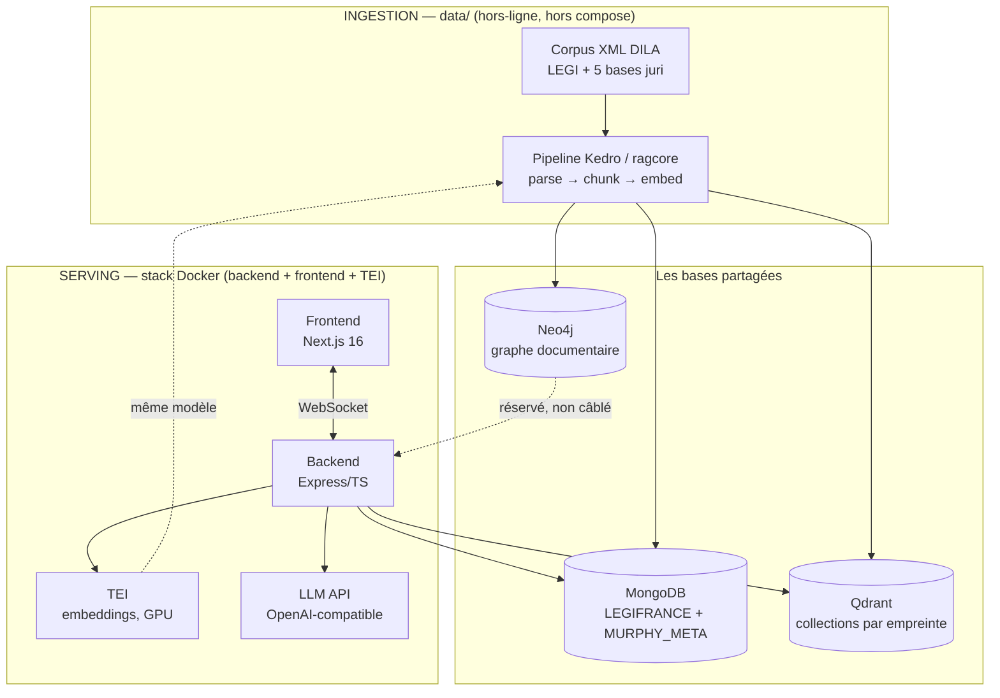

# Architecture système — Murphy

Vue d'ensemble du système complet. **La documentation technique détaillée vit au plus près
du code, dans le `docs/` de chaque projet** :

- [`backend/docs/`](../../backend/docs/README.md) — le serving (API RAG Express/TS)
- [`frontend/docs/`](../../frontend/docs/README.md) — l'UI de chat (Next.js)
- [`data/docs/`](../../data/docs/README.md) — l'ingestion (Kedro + ragcore)

Ce document ne couvre que ce qu'aucun projet ne peut dire seul : comment les deux
moitiés du système s'articulent.

## Les deux moitiés

Murphy est un chatbot RAG sur les données juridiques françaises (corpus DILA/LEGIFRANCE).
Deux systèmes **qui ne partagent que des bases de données — aucun code, aucun appel** :



- **Ingestion** (`data/`) : un pipeline Kedro qui tourne à la demande, sur l'hôte, hors
  de la stack Docker. Il lit le corpus XML, le parse, le découpe, l'embarque et peuple
  les trois bases. Détails : [`data/docs/ARCHITECTURE.md`](../../data/docs/ARCHITECTURE.md).
- **Serving** (`backend/` + `frontend/` + compose) : stateless, chaque requête recompute
  le pipeline embed → retrieve → fetch → stream LLM. Détails :
  [`backend/docs/ARCHITECTURE.md`](../../backend/docs/ARCHITECTURE.md).

## Les contrats entre les deux

C'est la seule zone où une modification d'un côté casse l'autre. Quatre contrats :

| Contrat | Écrit par l'ingestion | Lu par le serving |
|---|---|---|
| **Pointeur de collection** | `MURPHY_META.meta_published_collection` (clé `current`), mis à jour **seulement par un run `ok`**, avec la version du contrat (`serving_contract_version`) | Au boot (`backend/src/infra/collectionPointer.ts`) : c'est lui qui dit quelle collection Qdrant fait foi. Pas de repli : refus de démarrer sans pointeur, sur une autre version du contrat (ADR-039) ou sur une collection absente. |
| **Vecteurs** | Collections Qdrant nommées par l'**empreinte** de la config d'ingestion (normalisation + chunking + modèle) — jamais un nom fixe ; payload `chunk_id`, `identifier`, `owner_id`, `char_start`, `char_end` (ADR-039) | Recherche cosine top-K dans la collection pointée |
| **Contenu** | Mongo `LEGIFRANCE.documents` (+ `manifest`) : un document entier par `(identifier, owner_id)` | Lecture des documents parents ; le texte d'un passage est `content[char_start:char_end]` (points de code). Le passage va au LLM, le document entier au client (`data-parentDocument`) |
| **Modèle d'embedding** | `all-mpnet-base-v2`, 768 dim, Cosine — vérifié contre TEI au démarrage du run | Le même modèle via le même conteneur TEI |

Le modèle d'embedding est le contrat le plus fragile : question et corpus doivent être
embarqués par le **même** modèle. C'est pourquoi il n'y a qu'**un** fichier
d'environnement (`.env.dev` à la racine, gitignoré), partagé par le conteneur TEI, le
backend et le pipeline d'ingestion.

Neo4j est peuplé par l'ingestion (nœuds documents + arêtes typées par verbe + relations
pendantes) mais **pas encore câblé** dans le chemin de requête du backend — réservé à
l'enrichissement de contexte par graphe.

## La stack Docker (racine du repo)

`docker-compose.base.yml` + overrides `.dev.yml` / `.prod.yml` : backend, frontend,
MongoDB, Qdrant, Neo4j, TEI (GPU NVIDIA requis). L'ingestion n'est **pas** dans compose —
elle tourne sur l'hôte et parle aux bases via les ports publiés.

Scripts racine (`package.json`, tous exigent `.env.dev`) :

```bash
npm run up | watch | logs | status | down | build
```

Ports dev : frontend `3000`, backend `5000`, Qdrant `6333`, Mongo `27017`, Neo4j
`7474`/`7687`, TEI `5001→80`.

### Production

Aucun script ne l'enveloppe : `docker compose -f docker-compose.base.yml -f
docker-compose.prod.yml --env-file .env.dev --profile serve up -d --build` (et `down`
avec les mêmes options).

- **URL du backend fixée au build** : Next inline `NEXT_PUBLIC_API_URL` dans le bundle
  client. Compose la passe en argument de build ; la changer demande de reconstruire
  l'image frontend.
- **Ports publiés** : frontend `3000` et backend `5000`, car le navigateur appelle le
  backend directement. `CORS_ORIGIN` doit valoir l'origine publique du frontend. Les
  bases et TEI restent sur le réseau interne.
- **Pas de reverse proxy** tant que rien n'est déployé (TR-03) : ni TLS, ni `trust
  proxy` (`TRUST_PROXY` dans `backend/src/app.ts`).
- Les images tournent en utilisateur `node` ; `NODE_ENV` vient de la cible de build.
- TEI met environ 4 min à être prêt après la création du conteneur (mesuré sur une RTX
  3050 : un cœur à 100 %, GPU inactif) et dépasse 4 Go de mémoire pendant ce
  chargement (1 Go ensuite). Un `mem_limit` de 2 Go l'empêchait de démarrer.

## Où vit quoi (un seul dépôt, ADR-040)

| Emplacement | Contenu |
|---|---|
| `docs/pilotage/` | Pilotage PM² : backlog, exigences, risques, statut |
| `docs/product/` | Vision, versions, programme, **ADRs** (les décisions d'architecture citées partout : ADR-022 régimes dev/prod, ADR-023 interrupteur d'embedding, …) |
| `docs/technical/` | Ce document — la vue système, et rien d'autre |
| `backend/`, `frontend/`, `data/`, `eval/` | Les projets — code + leur propre `docs/`. `backend` et `frontend` sont des npm workspaces (un seul lockfile à la racine) ; `data` et `eval` sont en Python |
| `packages/contract/` | `@murphy/contract` : le contrat du flux backend ↔ frontend (schémas zod, types déduits), compilé, partagé par les deux workspaces. Une modification casse la compilation des deux côtés à la fois |
| `docker-compose.*.yml` | La stack de serving |

Convention de documentation : chaque projet porte un `docs/README.md` (index +
opérations), un `docs/ARCHITECTURE.md` (vue d'ensemble du sous-système) et un
`docs/reference/` (les références détaillées). `docs/` à la racine ne documente que le
transversal.
